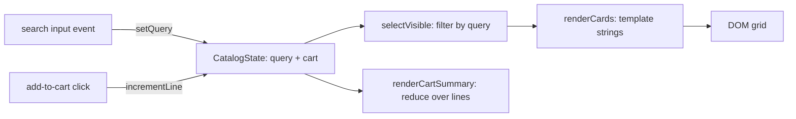

# Design — Checkpoint 1: RevoShop Frontend Foundations

## Overview

Four self-contained exercises in one repository, ordered so each layer builds on the previous: semantic HTML/CSS, then vanilla JS DOM/events, then vanilla JS array processing, then a typed and Tailwind-styled product catalog.

Guiding constraints:

- **No framework, no bundler.** The point of the checkpoint is to see the machinery React hides. Only two build tools exist, both single-purpose: `tsc` (types to JS) and the Tailwind CLI (utility classes to CSS).
- **The `html-css/` and `javascript/` exercises open by double-clicking the HTML file.** No install, no server. They use classic `<script src>` (not modules) specifically so the `file://` protocol works.
- **The `typescript-tailwind/` exercise requires a build plus a local static server.** ES modules are blocked over `file://` by browser CORS rules, so that folder documents `npm run build` plus a static server. This is a real constraint, not a preference.
- **Product data is modeled once, in TypeScript,** then rendered and styled. Types come before styling.

### Tailwind version note

Tailwind CSS v4 changed installation. There is no `npx tailwindcss init`, and no `tailwind.config.js` — the `init` command was removed in v4. The CLI ships as a separate package, and configuration moved into the CSS file itself via `@import "tailwindcss"`, `@source`, and `@theme`. This design targets v4. The rubric item "installs and configures Tailwind" is satisfied through that CSS-based configuration surface (`@source` scan paths plus `@theme` custom design tokens), which is what v4 supports.

Source: [Tailwind CLI installation](https://tailwindcss.com/docs/installation/tailwind-cli). Content was rephrased for compliance with licensing restrictions.

## Architecture

### Repository Layout

```
module-3-alzedmkrom/
├─ README.md                      # what each folder is, how to run it
├─ .gitignore                     # node_modules/, dist/, OS cruft
├─ html-css/
│  ├─ index.html                  # semantic profile page + contact form
│  └─ styles.css                  # Grid, Flexbox, box model, media queries
├─ javascript/
│  ├─ dom-events.html             # page for the DOM + events exercise
│  ├─ dom-events.js               # select/update, toggle class, create/remove, click+submit
│  ├─ array-methods.html          # page for the array-processing exercise
│  ├─ array-methods.js            # forEach, map, filter, reduce
│  └─ styles.css                  # shared; holds the classes the JS toggles
├─ typescript-tailwind/
│  ├─ package.json                # scripts: build:ts, build:css, build, watch, typecheck
│  ├─ tsconfig.json               # strict, ES modules, rootDir src to outDir dist
│  ├─ index.html                  # catalog shell; loads dist/output.css + dist/main.js
│  ├─ src/
│  │  ├─ input.css                # @import "tailwindcss"; @source; @theme
│  │  ├─ types.ts                 # interfaces, type aliases, union types
│  │  ├─ data.ts                  # product records + category lookup, typed
│  │  ├─ styles.ts                # typed field to Tailwind class string mapping
│  │  └─ main.ts                  # render, live search filter, cart state, event wiring
│  └─ dist/                       # generated (gitignored): compiled .js modules + output.css
└─ screenshots/
   ├─ profile-desktop.png
   ├─ profile-mobile.png
   └─ catalog-search.png
```

#### Why the layout is this shape

The three top-level folders and the README are fixed by the deliverables; the rest is kept deliberately flat.

- **`javascript/` is flat, with no per-exercise subfolders and no hub page.** The deliverable asks for one folder holding both exercises as plain JS runnable in the browser. Two HTML pages plus two scripts plus one shared stylesheet satisfies that, and a grader opens the file they want directly. Nothing in the rubric scores directory nesting.
- **Two separate pages, not one combined page.** The rubric grades DOM/event handling and array processing as separate concerns, so keeping one page per exercise makes each piece of evidence unambiguous. That is worth one extra file.
- **`src/` and `dist/` are kept in the TypeScript project.** `rootDir` and `outDir` are the clearest demonstration of a correctly configured `tsconfig.json`, which is an explicit rubric line. Compiling in place would scatter generated `.js` beside the `.ts` sources and muddy both the diff and the `.gitignore`.
- **`styles.ts` stays separate from `main.ts`.** Mapping typed data to Tailwind class strings is its own rubric line, and it is the one genuinely separable piece: pure functions, no DOM. A grader can open one short file and tick that item off.
- **Rendering, search, cart state and event wiring share `main.ts`.** They are tightly coupled, and splitting them left a bootstrap file that did nothing but call two functions. Expected size is roughly 150 lines, which stays navigable.

`dist/` is gitignored per Requirement 1.6. The README therefore documents the build for `typescript-tailwind/`, and the committed screenshots give visual proof without requiring one.

---

## Data Models

_Requirements: 5.2, 5.3, 5.4, 5.6, 5.7_

All product typing lives in `typescript-tailwind/src/types.ts`. This one file carries the type-system rubric lines, so it is kept short and readable rather than spread across the project.

### Backend alignment

The exercise data is static, but the shape mirrors the existing RevoShop database so the final checkpoint is a data-source swap and not a rewrite. Both tables are known.

`categories`:

| id | name | description |
|---|---|---|
| 1 | Apparel | Clothing items including shirts, t-shirts, dresses, and formal wear |
| 2 | Footwear | Athletic shoes, casual shoes, and socks |
| 3 | Accessories | Outfit complements such as hats, sunglasses, watches, and belts |
| 4 | Bags | Backpacks, messenger bags, and travel storage containers |

`products` columns: `id` (integer), `category_id` (integer, foreign key to `categories.id`), `name` (text), `description` (text), `price` (integer), `stock_quantity` (integer), `created_at` (timestamp with offset, `+0700`), `is_delete` (boolean).

Consequences for the type model:

1. **Category names and ids mirror the table verbatim.** No invented categories, no renaming later.
2. **Products reference a category by id**, as the table does, with a typed lookup for display.
3. **Price is a whole-rupiah integer.** Values in the table are `850000`, `75000`, `195000` and similar, with no decimal component, so formatting uses `Intl.NumberFormat` with zero fraction digits and no currency arithmetic is needed.
4. **Availability is derived from `stock_quantity`, never stored.** The table holds a count, not a UI state.
5. **`is_delete` is a soft-delete flag**, so the catalog filters on it rather than assuming every row is visible.
6. **No image, brand, rating, tags or dimensions columns exist.** Earlier drafts of this design invented all five. They are removed: a card that renders fields the API cannot supply is a card that breaks in Checkpoint 2. Cards render name, description, category, price and stock state, which is what the table actually holds.

### Types

```ts
// --- categories table ---

// Numeric literal union - mirrors categories.id
export type CategoryId = 1 | 2 | 3 | 4;

// String literal union - mirrors categories.name verbatim
export type CategoryName = 'Apparel' | 'Footwear' | 'Accessories' | 'Bags';

export interface Category {
  id: CategoryId;
  name: CategoryName;
  description: string;
}

// Typed lookup keyed by the id union - every id must have an entry
export type CategoryLookup = Record<CategoryId, Category>;

// --- products table ---

// The wire shape: products columns exactly as a JSON API serializes them.
export interface ProductRecord {
  id: number;
  category_id: CategoryId;
  name: string;
  description: string;
  price: number;           // whole rupiah, no decimals
  stock_quantity: number;
  created_at: string;      // ISO 8601 with offset, e.g. '2026-08-14T18:44:04.027+07:00'
  is_delete: boolean;      // soft-delete flag
}

// The app model: same data, idiomatic TypeScript naming.
export interface Product {
  id: number;
  categoryId: CategoryId;
  name: string;
  description: string;
  price: number;
  stockQuantity: number;
  createdAt: string;
  isDeleted: boolean;
}

// Derived from stock_quantity, never stored on the product.
export type Availability =
  | { kind: 'in-stock'; quantity: number }
  | { kind: 'low-stock'; quantity: number }
  | { kind: 'out-of-stock' };

// What the renderer consumes: a product joined with its category and
// its computed availability. Nested typed objects, the same shape an
// expanded API response would return.
export interface ProductView extends Product {
  category: Category;
  availability: Availability;
}

export type ProductList = Product[];              // typed array of typed objects
export type CartLines = Record<number, number>;   // product id to quantity

export interface CatalogState {
  query: string;
  cart: CartLines;
}
```

### Mapping and deriving

```ts
export function toProduct(record: ProductRecord): Product {
  return {
    id: record.id,
    categoryId: record.category_id,
    name: record.name,
    description: record.description,
    price: record.price,
    stockQuantity: record.stock_quantity,
    createdAt: record.created_at,
    isDeleted: record.is_delete,
  };
}

export const LOW_STOCK_THRESHOLD = 5;

export function availabilityOf(product: Product): Availability {
  if (product.stockQuantity <= 0) return { kind: 'out-of-stock' };
  if (product.stockQuantity <= LOW_STOCK_THRESHOLD) {
    return { kind: 'low-stock', quantity: product.stockQuantity };
  }
  return { kind: 'in-stock', quantity: product.stockQuantity };
}

export function toView(product: Product, categories: CategoryLookup): ProductView {
  return {
    ...product,
    category: categories[product.categoryId],
    availability: availabilityOf(product),
  };
}
```

Three small functions, each with a single job:

- `toProduct` is the seam, and it is permanent. The Flask API serializes snake_case, so the wire shape and the app model genuinely differ and something has to bridge them. Checkpoint 1 feeds this function a literal array; Checkpoint 2 feeds it parsed JSON. Nothing downstream changes, and no component ends up reading `product.stock_quantity`.
- `availabilityOf` owns the stock-to-state rule, so the badge, the label, and the disabled add-to-cart button cannot disagree.
- `toView` performs the category join. `categories[product.categoryId]` returns `Category` and not `Category | undefined`, because `CategoryLookup` is a `Record` over a closed literal union rather than an index signature, so `noUncheckedIndexedAccess` does not widen it.

### Carrying this into Checkpoint 2

Confirmed: the Flask API serializes snake_case, matching the column names. That settles two things.

- **`ProductRecord` is the API contract**, written once and reused. `ProductList` and every render path stay camelCase, so React components in Checkpoint 2 read `product.stockQuantity`, not `product.stock_quantity`.
- **`ProductRecord` is a compile-time contract only.** `JSON.parse` hands back `any`, so a type annotation on a fetch result is an assertion, not a check. Checkpoint 1 has no network call and no exposure here, since the literals are checked by `tsc` at build time. When the fetch arrives in Checkpoint 2, the response needs validating at the boundary before it is treated as `ProductRecord[]`. Noting it now so the gap is deliberate rather than discovered later.

### Seed data

`data.ts` holds these ten rows as `ProductRecord` literals, copied from the `products` table. `category_id` is a foreign key into `categories.id`, and `is_delete` is boolean, false on every current row.

| id | category_id | name | price | stock_quantity |
|---|---|---|---|---|
| 1 | 2 | Nike Air Max Running Shoes | 850000 | 50 |
| 2 | 1 | Plain Cotton Combed T-Shirt | 75000 | 197 |
| 3 | 1 | Fleece Jogger Pants | 195000 | 80 |
| 4 | 3 | Unisex Baseball Cap | 120000 | 150 |
| 5 | 1 | Windbreaker Jacket | 450000 | **4** |
| 6 | 2 | Sports Socks 3-Pack | 55000 | 295 |
| 7 | 4 | Waterproof Backpack | 320000 | 60 |
| 8 | 3 | UV400 Sunglasses | 135000 | 100 |
| 9 | 3 | Digital Sports Watch | 275000 | **0** |
| 10 | 3 | Leather Belt | 180000 | 75 |

Descriptions are copied verbatim from the table as well.

**Two stock values are deliberately altered.** In the live table every row sits between 30 and 295, so with untouched values the `low-stock` and `out-of-stock` badges would never render and could not be screenshotted for the deliverable. Row 5 drops from 30 to 4 (low stock, at or under the threshold of 5) and row 9 drops from 45 to 0 (out of stock, which also exercises the disabled add-to-cart path). The other eight keep their real values. This is stated in the README so it is not mistaken for a schema mismatch.

Category spread across the ten rows is Apparel 3, Footwear 2, Accessories 4, Bags 1. Uneven, which is useful: searching a category name returns visibly different result counts, and all four accent colors appear at least once in a single screenshot.
Coverage: `interface` (Req 5.2) via `Category`, `ProductRecord`, `Product`, `ProductView`, `CatalogState`; `type` aliases (5.2) via `CategoryId`, `CategoryName`, `CategoryLookup`, `Availability`, `ProductList`, `CartLines`; union types in three flavors (5.3) — numeric literal union, string literal union, discriminated union of shapes — plus `Product | undefined` from cart lookups; nested typed objects and arrays (5.4) via `ProductView.category`, `ProductView.availability`, `Product[]`, and the `Record` lookups; verbatim backend taxonomy (5.6); stock stored and availability derived (5.7).

---
## Components and Interfaces

### Component 1 — Semantic Profile Page (`html-css/`)

_Requirements: 2.1 through 2.8_

#### Document structure

Landmark elements carry the structure. A `div` appears only where a purely visual wrapper is genuinely needed.

```
<header>            -> site identity + <nav> (Flexbox row)
  <nav><ul><li><a>
<main>
  <section id="profile">   -> avatar  + bio; CSS Grid 2D via grid-template-areas
  <section id="skills">    -> <ul> of skill chips (Flexbox wrap)
  <section id="projects">  -> <article> cards in CSS Grid (2D: multi-row, multi-column)
  <section id="contact">   -> <form> with <fieldset>/<legend>
<footer>            -> <address> + copyright
```

Each `section` opens with an `h2` so the document outline stays valid. Project cards use `<article>` with `h3`, a paragraph, and a `<ul>` of tech tags.

#### Contact form

| Field | Element / type | Notes |
|---|---|---|
| Name | `input type="text"` | `required`, `autocomplete="name"` |
| Email | `input type="email"` | `required`, triggers native validation |
| Phone | `input type="tel"` | optional, hint wired via `aria-describedby` |
| Subject | `select` | grouped `option` values |
| Message | `textarea` | `required`, explicit `rows` |
| Newsletter | `input type="checkbox"` | |
| Submit | `button type="submit"` | |

Every control gets an explicit `<label for>` paired to the control `id` — not a placeholder standing in for a label. Fields group inside `<fieldset>` with `<legend>`.

The profile page is deliberately JavaScript-free. Form submission behavior (`preventDefault`) belongs to Component 2, where events are the actual subject.

#### CSS strategy

- **Selector variety** (Req 2.3): element selectors (`body`, `h1`, `a`), class selectors (`.card`, `.chip`), descendant and child combinators (`.projects .card h3`), attribute selectors (`input[type="email"]`), and pseudo-classes (`:hover`, `:focus-visible`, `:nth-child`). No inline `style` attributes.
- **Box model** (Req 2.4): a `box-sizing: border-box` reset, then cards demonstrate all four layers explicitly — `margin` for outer spacing, a visible `border`, `padding` for inner breathing room, content constrained by `max-width`. A short CSS comment labels the layers so the intent is legible to a grader.
- **CSS Grid, two-dimensional** (Req 2.5): `#profile` uses named areas so it is genuinely 2D (rows and columns), and `#projects` uses `repeat(auto-fit, minmax(16rem, 1fr))` with `gap`.

```css
#profile .layout {
  display: grid;
  grid-template-columns: 12rem 1fr;
  grid-template-areas:
    "avatar heading"
    "avatar bio"
    "avatar stats";
  gap: 1rem 2rem;
}
```

- **Flexbox** (Req 2.6): `nav ul` as a row with `justify-content: space-between`; `.skills` as a wrapping row of chips.
- **Breakpoints** (Req 2.7, 2.8): primary reflow at `768px`, secondary polish at `480px`.

```css
@media (max-width: 768px) {
  #profile .layout {
    grid-template-columns: 1fr;
    grid-template-areas: "avatar" "heading" "bio" "stats";
  }
}
```

Custom properties (`--color-accent`, `--space-md`) live in `:root` to keep values consistent.

---

### Component 2 — DOM & Events Exercise (`javascript/dom-events.*`)

_Requirements: 3.1 through 3.7_

Theme: a **study planner**. Small enough to read in one sitting, rich enough to cover every required interaction.

#### Loading model

`<script src="dom-events.js" defer></script>` — a classic script, not a module, so the page works from `file://`.

#### Variables and logic (Req 3.2)

Explicit, varied data types with JSDoc annotations, so the types are visible without TypeScript:

```js
/** @type {string} */
const APP_LABEL = 'Study Planner';
/** @type {number} */
let taskCounter = 0;
/** @type {boolean} */
let isCompactMode = false;
/** @type {{ id: number, title: string, minutes: number, done: boolean }[]} */
const tasks = [];
```

Operators and helper functions carry the logic: arithmetic (`totalMinutes + minutes`), strict equality (`task.id === id`), logical (`title && minutes > 0`), a ternary for label text, template literals for output. Named functions (`addTask`, `removeTask`, `renderSummary`, `formatDuration`) keep it structured rather than one long handler.

#### Required DOM operations

| Operation | Implementation | Requirement |
|---|---|---|
| Select | `getElementById`, `querySelector`, `querySelectorAll` | 3.3 |
| Update content and attributes | `textContent` on the summary, `setAttribute('aria-pressed', ...)` on the toggle, `disabled` on submit while invalid | 3.3 |
| Toggle class | `classList.toggle('compact')` on `<main>`; `classList.toggle('task--done')` per task | 3.4 |
| Create element | `document.createElement('li')` plus `append` into the list | 3.5 |
| Remove element | per-task delete button calls `li.remove()` | 3.5 |
| `click` handler | compact-mode toggle, delete, done-toggle | 3.6 |
| `submit` handler | add-task form | 3.6 |
| `preventDefault` | first line of the submit handler | 3.7 |

#### Event wiring

The form submit handler binds directly. Task-level clicks use **event delegation** on the list container, so dynamically created elements work without rebinding — the same problem React solves with its synthetic event system, worth seeing firsthand.

```js
form.addEventListener('submit', (event) => {
  event.preventDefault();          // Req 3.7 - no page reload
  // read and validate inputs, then addTask()
});

list.addEventListener('click', (event) => {
  const button = event.target.closest('[data-action]');
  if (!button) return;
  // dispatch on button.dataset.action: 'toggle' or 'delete'
});
```

Empty or invalid input surfaces an inline message (`role="alert"`) rather than an `alert()` dialog. The live summary region uses `aria-live="polite"`.

---

### Component 3 — Array Methods Exercise (`javascript/array-methods.*`)

_Requirements: 4.1 through 4.6_

Theme: **order line items** built from the same ten RevoShop products, so the data foreshadows the catalog and the numbers stay familiar across exercises.

```js
const orderLines = [
  { id: 1, product: 'Nike Air Max Running Shoes', category: 'Footwear',    price: 850000, qty: 1 },
  { id: 2, product: 'Plain Cotton Combed T-Shirt', category: 'Apparel',    price:  75000, qty: 3 },
  { id: 3, product: 'Sports Socks 3-Pack',        category: 'Footwear',    price:  55000, qty: 2 },
  { id: 4, product: 'Waterproof Backpack',        category: 'Bags',        price: 320000, qty: 1 },
  { id: 5, product: 'UV400 Sunglasses',           category: 'Accessories', price: 135000, qty: 2 },
  // remaining rows drawn from the same ten products
];
```

Each of the four methods gets its own labeled section, rendered to the page and also logged, so results are observable (Req 4.6):

| Method | Use | Requirement |
|---|---|---|
| `forEach` | iterate rows, append a `<tr>` per order — side effect, no return value | 4.2 |
| `map` | transform into a new array of display rows (`{ label, subtotal }`, price formatted to IDR) | 4.3 |
| `filter` | select lines above a price threshold, and a second pass selecting a single category | 4.4 |
| `reduce` | aggregate the grand total; a second `reduce` builds a per-category subtotal object, showing reduce is not only for numbers | 4.5 |

Comments state the distinctions explicitly: `forEach` returns `undefined` and exists for side effects; `map` returns a new array of the same length; `filter` returns a same-or-shorter array of the same element type; `reduce` collapses to a single accumulator of any type. Chaining (`filter(...).map(...).reduce(...)`) appears once to show composition.

A small `formatIDR` helper built on `Intl.NumberFormat` keeps output readable.

---

### Component 4 — Typed Tailwind Product Catalog (`typescript-tailwind/`)

_Requirements: 5.1 through 5.5, 6.1 through 6.7_

Types for this component live in [Data Models](#data-models). This section covers compilation, the build pipeline, Tailwind configuration, and runtime behavior.

#### Strict compilation (`tsconfig.json`)

```json
{
  "compilerOptions": {
    "target": "ES2022",
    "module": "nodenext",
    "moduleResolution": "nodenext",
    "verbatimModuleSyntax": true,
    "lib": ["ES2022", "DOM", "DOM.Iterable"],
    "rootDir": "src",
    "outDir": "dist",
    "strict": true,
    "noUncheckedIndexedAccess": true,
    "noFallthroughCasesInSwitch": true,
    "noUnusedLocals": true,
    "noUnusedParameters": true,
    "forceConsistentCasingInFileNames": true,
    "sourceMap": true,
    "skipLibCheck": true
  },
  "include": ["src/**/*.ts"]
}
```

Three decisions worth calling out:

- **`module` and `moduleResolution` set to `nodenext`, with `.js` extensions on relative imports.** Source writes `import { Product } from './types.js';`. TypeScript resolves that to `types.ts` at compile time and emits the specifier unchanged, producing browser-loadable ES modules with no bundler. Extensionless imports would break at runtime in the browser, and `nodenext` makes that a compile error instead of a surprise.
- **Not `node10`.** The older `moduleResolution: "node10"` (formerly `"node"`) was deprecated in TypeScript 6.0 and removed in 7.0, so it would fail outright on the pinned compiler. `nodenext` is the correct modern choice here and is valid on both TypeScript 5.x and 7.x, which keeps the project portable if a grader has an older toolchain.
- **`strict` plus `noUncheckedIndexedAccess`** satisfies Req 5.5: array indexing yields `T | undefined`, so a sloppy access genuinely fails the build. Narrowing has to be handled rather than assumed.

#### Build pipeline

```
src/*.ts      --tsc-------------------->  dist/*.js       --+   (entry: dist/main.js)
                                                            +--> index.html loads both
src/input.css --@tailwindcss/cli------->  dist/output.css --+
                        ^
                        +-- scans index.html and src/**/*.ts for class names
```

`package.json`:

```json
{
  "name": "revoshop-typescript-tailwind",
  "private": true,
  "type": "module",
  "scripts": {
    "build:ts": "tsc",
    "build:css": "tailwindcss -i ./src/input.css -o ./dist/output.css --minify",
    "build": "npm run build:ts && npm run build:css",
    "watch:ts": "tsc --watch",
    "watch:css": "tailwindcss -i ./src/input.css -o ./dist/output.css --watch",
    "typecheck": "tsc --noEmit",
    "serve": "serve . --listen 5173"
  },
  "devDependencies": {
    "typescript": "7.0.2",
    "tailwindcss": "4.3.3",
    "@tailwindcss/cli": "4.3.3",
    "serve": "14.2.6"
  }
}
```

Versions are pinned exactly rather than range-specified, and these numbers were verified against the npm registry while writing this design (`npm view <pkg> version`). Note that `typescript@7` is the native-port compiler and is the current `latest`; the `nodenext` module settings above are chosen partly because they work identically on 5.x, so the project is not locked to one major.

#### Tailwind configuration (`src/input.css`)

```css
@import "tailwindcss";

/* v4 replaces the content array from tailwind.config.js */
@source "./**/*.ts";
@source "../index.html";

/* v4 replaces theme.extend - custom design tokens become real utilities */
@theme {
  --color-revo-50:  oklch(0.97 0.02 250);
  --color-revo-500: oklch(0.58 0.17 255);
  --color-revo-700: oklch(0.45 0.16 258);
  --font-display: "Inter", ui-sans-serif, system-ui, sans-serif;
}
```

`@source` paths resolve relative to the CSS file. The custom tokens produce usable utilities (`bg-revo-500`, `font-display`), which is what demonstrates configuration rather than stock defaults.

**Hard rule for implementation:** Tailwind finds class names by scanning source text, so every class must appear as a complete literal string. `bg-emerald-100` spelled out is found; a template literal assembling `bg-` + a variable + `-100` is not, and silently produces no CSS. `styles.ts` returns whole literal strings for exactly this reason.

#### Typed field to Tailwind classes (`src/styles.ts`)

_Requirement 6.4_

```ts
import type { Availability, CategoryId } from './types.js';

export function availabilityBadgeClass(availability: Availability): string {
  switch (availability.kind) {
    case 'in-stock':
      return 'bg-emerald-100 text-emerald-800 ring-emerald-200';
    case 'low-stock':
      return 'bg-amber-100 text-amber-800 ring-amber-200';
    case 'out-of-stock':
      return 'bg-rose-100 text-rose-800 ring-rose-200';
    default: {
      const exhaustive: never = availability;   // compile-time completeness check
      return exhaustive;
    }
  }
}

export function availabilityLabel(availability: Availability): string {
  switch (availability.kind) {
    case 'in-stock':     return `In stock (${availability.quantity})`;
    case 'low-stock':    return `Only ${availability.quantity} left`;
    case 'out-of-stock': return 'Out of stock';
  }
}

// Keyed by the CategoryId union, so all four database ids must be covered.
// Written as a Record rather than a switch to make the exhaustiveness structural.
const CATEGORY_ACCENT: Record<CategoryId, string> = {
  1: 'bg-violet-50 text-violet-700 ring-violet-200',   // Apparel
  2: 'bg-cyan-50 text-cyan-700 ring-cyan-200',         // Footwear
  3: 'bg-fuchsia-50 text-fuchsia-700 ring-fuchsia-200',// Accessories
  4: 'bg-orange-50 text-orange-700 ring-orange-200',   // Bags
};

export function categoryAccentClass(categoryId: CategoryId): string {
  return CATEGORY_ACCENT[categoryId];
}
```

Two different exhaustiveness techniques, deliberately:

- `availabilityBadgeClass` uses a `switch` with a `never` assignment. Adding a variant to `Availability` breaks the build until this function handles it.
- `categoryAccentClass` uses `Record<CategoryId, string>`. Because the key type is the closed union `1 | 2 | 3 | 4`, omitting an id is a compile error, and the return type stays `string` rather than `string | undefined` even under `noUncheckedIndexedAccess` — a `Record` over a finite literal union is treated as complete.

If the backend ever adds a fifth category row, widening `CategoryId` fails the build in exactly one place, which is the point.

`availabilityLabel` also shows narrowing in action: `availability.quantity` is only reachable in the branches where that property exists.
#### Rendering and state (`src/main.ts`)

One source of truth plus a re-render on change — deliberately the mental model React formalizes later.



- **Render from typed data** (Req 6.1): `data.ts` holds the records, `toProduct` maps them, `toView` joins each to its `Category` and computed `Availability`, and the renderer consumes `ProductView[]`. Every card field (name, description, category chip, price, stock badge) comes from the typed object. Rows with `isDeleted` true are filtered out before render.
- **Live search** (Req 6.5): an `input` event on the search box, not `keyup`, so paste and the native clear button also fire. Matching is case-insensitive across `name`, `description`, and the resolved `category.name`. Debouncing is intentionally omitted — the dataset is ten rows, and the raw event-to-render loop is the thing being demonstrated.
- **Interactive state update** (Req 6.6): a per-card "Add to cart" increments that product line; the card then shows a live count with minus and plus controls; the header badge shows total items via `Object.values(cart).reduce(...)` plus the total rupiah. Increment is clamped to `stockQuantity`, and out-of-stock products render a disabled button, so the typed stock field drives behavior and not just color.
- **Empty state** (Req 6.7): zero matches renders a centered message block echoing the searched term with a "Clear search" button, inside the same grid container, so the layout never collapses.

Re-rendering replaces the grid `innerHTML`. Interpolated text passes through an `escapeHtml` helper. The data is local and static, so this is habit-building rather than strictly necessary, and it costs one small function.

#### Responsive Tailwind layout

_Requirement 6.3_

Mobile-first: base classes target narrow screens, breakpoint prefixes add columns.

```
grid grid-cols-1 gap-4 sm:grid-cols-2 lg:grid-cols-3 xl:grid-cols-4
```

Typography utilities carry the text hierarchy: `text-xs` / `text-sm` / `text-lg`, `font-medium` / `font-semibold` / `font-bold`, `tracking-tight`, `leading-relaxed`, `line-clamp-2` for long names, and `tabular-nums` on prices so digits do not jitter as counts change. The header and search bar use `flex flex-col gap-3 sm:flex-row sm:items-center sm:justify-between`. No hand-written CSS rules beyond the `@theme` tokens (Req 6.2).

---

## Correctness Properties

Properties that must hold, stated so a grader can check them by interaction rather than infer them.

### Property 1: Label coverage

**Validates: Requirements 2.2, 3.1**

Every form control on every page has exactly one associated `<label>`, matched by `for` and `id`. No control relies on a placeholder as its label.

### Property 2: No full-page reload on submit

**Validates: Requirements 3.6, 3.7**

Every `submit` handler calls `preventDefault()` before doing work, so the URL and scroll position never change on submit.

### Property 3: Layout reflow is monotonic

**Validates: Requirements 2.5, 2.7, 2.8, 6.3**

As the viewport narrows past each breakpoint, column count never increases. Desktop is multi-column, mobile is single-column, and no width produces horizontal overflow.

### Property 4: Union exhaustiveness

**Validates: Requirements 5.3, 5.5, 5.6, 6.4**

Every function that switches on `Availability.kind` handles all variants, enforced at compile time by assignment to `never`, and every `CategoryId` has an accent class, enforced by `Record<CategoryId, string>`. Adding an availability variant or a fifth category row breaks the build rather than rendering a blank badge or an undefined class.

### Property 5: Class strings are literal

**Validates: Requirements 6.2, 6.4**

Every Tailwind class that reaches the DOM exists as a complete literal string in scanned source, so no styled element can lose its CSS to the class scanner.

### Property 6: Search is a pure projection of state

**Validates: Requirements 6.1, 6.5**

The rendered card set always equals the filter applied to the full product list for the current query. Clearing the query restores the full list exactly; no card is lost or duplicated across successive keystrokes.

### Property 7: Search never yields a broken layout

**Validates: Requirements 6.7**

Zero matches renders the empty state inside the grid container, so the page always shows visible, meaningful content.

### Property 8: Cart totals are derived, never accumulated

**Validates: Requirements 6.6**

The header badge is recomputed from cart state on each render via `reduce`, so it cannot drift from the sum of the per-card counts.

### Property 9: Cart quantities stay non-negative

**Validates: Requirements 6.6**

Decrement clamps at zero and removes the line, so no negative or orphaned quantity is reachable.

### Property 10: Availability gates interaction

**Validates: Requirements 5.3, 5.7, 6.4, 6.6**

An out-of-stock product cannot be added to the cart. Its control is disabled, not merely styled differently. Because availability is derived from `stock` by a single function, the badge, the label, and the button state can never disagree.
### Property 11: Soft-deleted rows never render

**Validates: Requirements 5.6, 6.1**

A product whose `isDeleted` flag is true never appears in the grid, is never counted in the result total, and cannot be added to the cart, regardless of the search query.

### Property 12: Cart quantity never exceeds stock

**Validates: Requirements 5.7, 6.6**

Increment is clamped at `stockQuantity`, so no line can be ordered beyond what the row says exists. Combined with Property 9, every cart quantity stays within `0` to `stockQuantity` inclusive.

### Property 13: Category resolution is total

**Validates: Requirements 5.4, 5.6**

Every product resolves to exactly one `Category` through `CategoryLookup`. Because the lookup is a `Record` over the closed `CategoryId` union, there is no code path that renders a missing or undefined category.
## Accessibility

Applied across all four exercises rather than bolted on at the end:

- Landmark elements (`header`, `nav`, `main`, `footer`), one `h1` per page, no skipped heading levels.
- Every form control has an associated `<label>`; hints wired through `aria-describedby`.
- The search input is labeled, and the result count sits in a `role="status" aria-live="polite"` region, so a screen reader hears "3 products" as filtering happens.
- Cart quantity changes announce through that same live-region pattern.
- Icon-only buttons (minus, plus, delete) carry `aria-label`.
- Focus stays visible: `focus-visible:ring-2 focus-visible:ring-revo-500` in Tailwind, `:focus-visible` in plain CSS. No `outline: none` without a replacement.
- Interactive controls are real `<button>` elements, so keyboard and Enter/Space work without extra code.
- The catalog has no product imagery, since the `products` table carries no image column, so no decorative `img` elements need alt handling. The avatar on the profile page has a meaningful `alt`.
- Color is never the only signal. Availability badges pair color with text.

Full WCAG conformance cannot be asserted from code review alone; it needs testing with real assistive technology plus expert review. The list above covers the structural basics.

## Error Handling

The exercises are static and local, so error handling stays proportionate:

- **DOM lookups**: a `requireElement<T>` helper throws a clear message when an expected element is missing, instead of letting `null` propagate into a vague runtime failure. In TypeScript it doubles as a type guard returning a non-nullable element.
- **Form validation**: native constraints (`required`, `type="email"`) plus an explicit guard in the submit handler. Invalid input renders an inline `role="alert"` message and leaves entered values intact.
- **Empty results**: a designed state (Req 6.7), not an error path.
- **Exhaustiveness**: the `never` check turns an unhandled union variant into a compile error rather than a blank badge at runtime.
- **Build failures**: `tsc` is expected to fail loudly on type errors, since that is the evidence for Req 5.5. No `// @ts-ignore`, no `any` escape hatches.

## Testing Strategy

No test framework is introduced. The checkpoint asks for exercises, not a test suite, and the rubric is verified by inspection and interaction. Verification is therefore explicit and manual, with one automated gate.

**Automated:** the typecheck script must exit 0 (Req 5.1). A deliberate type error is introduced once, confirmed to fail the build, then reverted. That is the evidence for Req 5.5.

**Manual checklist, per component:**

1. Profile page: view source and confirm the landmarks; confirm every input has a matching `label for`; resize the browser through the 768px breakpoint and watch the grid collapse to one column; check `:hover` and `:focus-visible` with both mouse and keyboard.
2. DOM exercise: add a task (the page must not reload), toggle done (class toggles), delete (element removed), toggle compact mode (class on `main`), submit empty (inline error, no crash).
3. Array exercise: all four sections render; the grand total is cross-checked by hand against the data; console output matches the page.
4. Catalog: cards render from data; typing filters per keystroke; a nonsense query shows the empty state; add-to-cart updates both the card count and the header badge; the out-of-stock button is disabled; resizing through `sm` and `lg` changes the column count; badge colors differ by availability.

Screenshots are captured during this pass, which is also when Requirement 7 is satisfied.

## Build & Run (for the README)

```powershell
# html-css/ and javascript/ - no build step
# open the .html file directly in a browser

# typescript-tailwind/
cd typescript-tailwind
npm install
npm run build
npm run serve     # then open http://localhost:5173
```

The README states plainly why the last folder needs a static server: browsers refuse to load ES modules over `file://`, so opening `index.html` directly leaves the page unstyled and inert.

## Commit Plan

_Requirement 1.7, incremental history across all four areas._

| # | Scope | Message |
|---|---|---|
| 1 | repo skeleton | `chore: initialize repo with README and gitignore` |
| 2 | profile markup | `feat(html-css): add semantic profile page with contact form` |
| 3 | profile styling | `feat(html-css): style profile with grid, flexbox and responsive breakpoint` |
| 4 | DOM exercise | `feat(javascript): add DOM manipulation and event handling exercise` |
| 5 | array exercise | `feat(javascript): add forEach, map, filter and reduce exercise` |
| 6 | TS scaffold | `chore(typescript-tailwind): configure tsc and tailwind cli` |
| 7 | types and data | `feat(typescript-tailwind): model product data with interfaces and union types` |
| 8 | catalog render | `feat(typescript-tailwind): render typed product cards with tailwind utilities` |
| 9 | interactivity | `feat(typescript-tailwind): add live search filter and cart counter` |
| 10 | docs and assets | `docs: document folders, run steps and add screenshots` |

Ten commits, each coherent on its own, moving from HTML/CSS to JavaScript to TypeScript to Tailwind in order.

## Requirements Traceability

| Requirement | Satisfied by |
|---|---|
| 1.1 - 1.7 | Repository layout, README, `.gitignore`, commit plan |
| 2.1, 2.2 | `html-css/index.html`: landmarks, form with typed inputs and labels |
| 2.3, 2.4 | `html-css/styles.css`: selector variety, box model |
| 2.5, 2.6 | `#profile` grid areas, `#projects` auto-fit grid, nav and skills Flexbox |
| 2.7, 2.8 | `@media (max-width: 768px)` plus `480px` reflow |
| 3.1 | Classic `<script>`, no framework, no build |
| 3.2 | Typed variable declarations, operators, named functions |
| 3.3 - 3.5 | Select and update, `classList.toggle`, `createElement` and `remove` |
| 3.6, 3.7 | `click` and `submit` listeners, `preventDefault` |
| 4.1 - 4.6 | `array-methods.js`: four labeled sections, page plus console output |
| 5.1 | `tsconfig.json` plus the typecheck script |
| 5.2 | `Category`, `ProductRecord`, `Product`, `ProductView`, `CatalogState` interfaces; `CategoryId`, `CategoryName`, `CategoryLookup`, `Availability`, `ProductList`, `CartLines` aliases |
| 5.3 | Numeric literal union (`CategoryId`), string literal union (`CategoryName`), discriminated union (`Availability`), plus `Product \| undefined` from cart lookups |
| 5.4 | `Product[]` and `ProductView[]`, nested `ProductView.category` and `ProductView.availability`, `Record<CategoryId, Category>`, `Record<number, number>` |
| 5.5 | `strict` plus `noUncheckedIndexedAccess`, verified with a deliberate error |
| 5.6 | `CategoryId` and `CategoryName` mirror the `categories` table; `ProductRecord` mirrors the `products` columns; `toProduct` is the only mapping seam |
| 5.7 | `Product.stockQuantity` is stored, `availabilityOf` derives the `Availability` union |
| 6.1 | `main.ts` renders from `ProductView[]`, derived from `data.ts` records |
| 6.2 | `@import "tailwindcss"`, `@source`, `@theme`; utilities only |
| 6.3 | Typography utilities, mobile-first `sm:` / `lg:` / `xl:` grid |
| 6.4 | `availabilityBadgeClass` (switch plus `never`), `categoryAccentClass` (`Record<CategoryId, string>`) |
| 6.5 | `input` event, `selectVisible`, re-render |
| 6.6 | Cart counter per card plus header total |
| 6.7 | Empty-state block with a clear-search action |
| 7.1 - 7.3 | `screenshots/` captured during verification, linked from the README |
