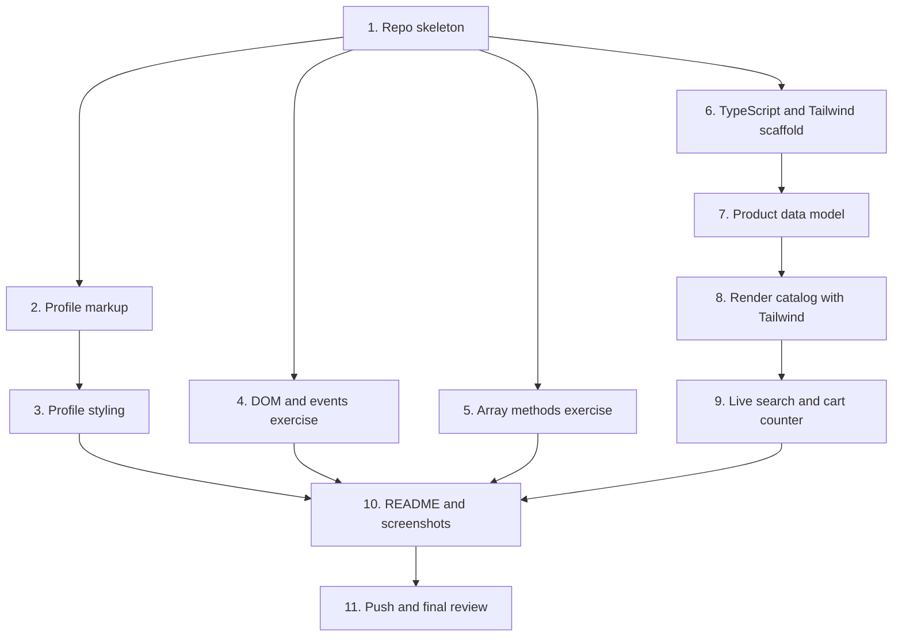

# Implementation Plan

## Overview

Ten commits, in dependency order: repo skeleton, then HTML/CSS, then JavaScript, then TypeScript, then Tailwind, then docs and screenshots. Each top-level task ends at a commit boundary so the history shows incremental progress across all four areas, which is itself a graded deliverable.

Tasks 2 through 5 need no install and no build. Task 6 is the only setup step, and everything from 7 onward depends on it.

## Task Dependency Graph



```json
{
  "waves": [
    { "wave": 1, "tasks": ["1"], "dependsOn": [] },
    { "wave": 2, "tasks": ["2", "4", "5", "6"], "dependsOn": ["1"] },
    { "wave": 3, "tasks": ["3", "7"], "dependsOn": ["2", "6"] },
    { "wave": 4, "tasks": ["8"], "dependsOn": ["7"] },
    { "wave": 5, "tasks": ["9"], "dependsOn": ["8"] },
    { "wave": 6, "tasks": ["10"], "dependsOn": ["3", "4", "5", "9"] },
    { "wave": 7, "tasks": ["11"], "dependsOn": ["10"] }
  ]
}
```
Task 1 gates everything. Tasks 2 and 3 are sequential, as are 6 through 9. The HTML/CSS chain, the two JavaScript exercises, and the TypeScript chain are independent of each other and can be done in any order once task 1 lands. Task 10 needs all four finished, since screenshots come from the working pages.

## Tasks
- [x] 1. Initialize repository skeleton
  - Create `.gitignore` covering `node_modules/`, `typescript-tailwind/dist/`, `*.log`, `.DS_Store`, `Thumbs.db`
  - Create `screenshots/` with a `.gitkeep` so the folder survives the first commit
  - Create a placeholder `README.md` with the project title and a folder list, to be filled in at task 10
  - Commit: `chore: initialize repo with README and gitignore`
  - _Requirements: 1.1, 1.4, 1.5, 1.6, 1.7_

- [ ] 2. Build the semantic profile page markup
- [x] 2.1 Write the page structure in `html-css/index.html`
  - Lay out `header` with a `nav` list, `main`, and `footer` with an `address`
  - Add four sections with `h2` headings: `#profile`, `#skills`, `#projects`, `#contact`
  - Inside `#profile`, add an avatar `img` with meaningful `alt`, a heading, a bio paragraph, and a short stats list
  - Inside `#skills`, add a `ul` of skill items
  - Inside `#projects`, add three `article` cards, each with `h3`, a paragraph, and a `ul` of tech tags
  - Use `div` only where a purely visual wrapper is needed, never in place of a landmark
  - _Requirements: 2.1_

- [ ] 2.2 Add the contact form
  - Wrap fields in `fieldset` with a `legend`
  - Add controls with explicit `label for` matched to each control `id`: name (`text`), email (`email`), phone (`tel`), subject (`select`), message (`textarea`), newsletter (`checkbox`)
  - Mark name, email and message `required`; add `autocomplete` where it applies
  - Add hint text for the phone field wired with `aria-describedby`
  - Add a `button type="submit"`
  - Verify every control has exactly one associated label, and that no placeholder is standing in for a label
  - Commit: `feat(html-css): add semantic profile page with contact form`
  - _Requirements: 2.2_

- [ ] 3. Style the profile page
- [ ] 3.1 Write base styles and the box model in `html-css/styles.css`
  - Add a `box-sizing: border-box` reset and `:root` custom properties for colors and spacing
  - Style with a deliberate range of selectors: element, class, descendant, attribute (`input[type="email"]`), and pseudo-class (`:hover`, `:focus-visible`, `:nth-child`)
  - On the project cards, set all four box model layers explicitly, with a comment labeling margin, border, padding and content
  - Ensure focus is always visible; never remove an outline without replacing it
  - _Requirements: 2.3, 2.4_

- [ ] 3.2 Build the Grid and Flexbox layouts
  - Give `#profile` a two-dimensional CSS Grid using `grid-template-columns` and `grid-template-areas` for avatar, heading, bio and stats
  - Give `#projects` a grid with `repeat(auto-fit, minmax(16rem, 1fr))` and a `gap`
  - Lay out the `nav` list as a Flexbox row, and the skills list as a wrapping Flexbox row of chips
  - _Requirements: 2.5, 2.6_

- [ ] 3.3 Add responsive breakpoints and verify the reflow
  - Add a `max-width: 768px` media query collapsing `#profile` to a single column by redefining `grid-template-areas`, and reducing the projects grid
  - Add a `max-width: 480px` query for type scale and spacing polish
  - Resize the browser through both breakpoints and confirm column count never increases as the viewport narrows, and that no width produces horizontal overflow
  - Commit: `feat(html-css): style profile with grid, flexbox and responsive breakpoint`
  - _Requirements: 2.7, 2.8_
- [ ] 4. Build the DOM manipulation and events exercise
- [ ] 4.1 Create the exercise page and shared stylesheet
  - Create `javascript/dom-events.html` loading `styles.css` and `dom-events.js` with `defer`, using a classic script tag rather than a module so the page opens over `file://`
  - Add the study planner shell: an `h1`, an add-task `form` with labeled title and minutes inputs, an empty `ul` for tasks, a summary region with `aria-live="polite"`, an error region with `role="alert"`, and a compact-mode toggle `button`
  - Create `javascript/styles.css` holding the classes the script toggles: `.compact`, `.task--done`, plus base layout and visible focus styles
  - _Requirements: 3.1_

- [ ] 4.2 Declare typed state and helper functions in `javascript/dom-events.js`
  - Declare variables covering several data types with JSDoc annotations: a string label, a numeric counter, a boolean mode flag, and an array of task objects
  - Write named helpers `addTask`, `removeTask`, `toggleTask`, `renderSummary`, `formatDuration`
  - Use arithmetic, strict equality, logical and ternary operators plus template literals inside those helpers rather than inline in event callbacks
  - _Requirements: 3.2_

- [ ] 4.3 Implement DOM selection, creation and removal
  - Select elements with `getElementById`, `querySelector` and `querySelectorAll`
  - Build each task row with `document.createElement` and `append`, including done-toggle and delete buttons carrying `data-action` and `aria-label`
  - Remove a task row with `element.remove()` and keep the backing array in sync
  - Update the summary with `textContent`, and update attributes with `setAttribute('aria-pressed', ...)` on the toggle
  - _Requirements: 3.3, 3.5_

- [ ] 4.4 Implement class toggling and event handling
  - Toggle `compact` on `main` from the mode button, and `task--done` on a row from its done button
  - Attach the `submit` handler on the form, calling `preventDefault()` as its first statement, then validating and adding the task
  - Attach a delegated `click` handler on the list container, dispatching on `closest('[data-action]')` so dynamically created rows work without rebinding
  - Show invalid input in the `role="alert"` region and leave entered values intact, with no `alert()` dialogs
  - Verify in the browser: submitting does not reload the page or change the URL, toggling and deleting work, and submitting empty input shows an inline error without crashing
  - Commit: `feat(javascript): add DOM manipulation and event handling exercise`
  - _Requirements: 3.4, 3.6, 3.7_

- [ ] 5. Build the array-processing exercise
- [ ] 5.1 Create the page and seed the order line data
  - Create `javascript/array-methods.html` loading the shared `styles.css` and `array-methods.js`, with four labeled result sections and a table for the row output
  - In `javascript/array-methods.js`, declare an `orderLines` array built from the real RevoShop products, each entry holding id, product name, category name, price in whole rupiah, and quantity
  - Add a `formatIDR` helper using `Intl.NumberFormat` with zero fraction digits
  - _Requirements: 4.1_

- [ ] 5.2 Implement the four array operations with observable output
  - Use `forEach` to append a table row per order line, noting in a comment that it returns `undefined` and exists for side effects
  - Use `map` to build a new array of display rows with label and subtotal, noting that it returns a new array of the same length
  - Use `filter` twice: once for lines above a price threshold, once for a single category, noting that it returns a same-or-shorter array of the same element type
  - Use `reduce` twice: once for the grand total, once to build a per-category subtotal object, showing the accumulator need not be a number
  - Chain `filter().map().reduce()` once to demonstrate composition
  - Render each result into its labeled section and also log it, then cross-check the grand total by hand against the data
  - Commit: `feat(javascript): add forEach, map, filter and reduce exercise`
  - _Requirements: 4.2, 4.3, 4.4, 4.5, 4.6_
- [ ] 6. Scaffold the TypeScript and Tailwind project
- [ ] 6.1 Create `typescript-tailwind/package.json` and install pinned dependencies
  - Set `"private": true` and `"type": "module"`
  - Add scripts: `build:ts`, `build:css`, `build`, `watch:ts`, `watch:css`, `typecheck`, and a static-file script serving the folder on port 5173
  - Install exact pinned versions as devDependencies: `typescript@7.0.2`, `tailwindcss@4.3.3`, `@tailwindcss/cli@4.3.3`, `serve@14.2.6`
  - Confirm the installed versions match the pins, and adjust the design if the registry has moved
  - _Requirements: 1.3_

- [ ] 6.2 Configure `typescript-tailwind/tsconfig.json`
  - Set `target: ES2022`, `module: nodenext`, `moduleResolution: nodenext`, `verbatimModuleSyntax: true`, `lib: ["ES2022", "DOM", "DOM.Iterable"]`
  - Set `rootDir: src`, `outDir: dist`, `sourceMap: true`, `include: ["src/**/*.ts"]`
  - Enable `strict`, `noUncheckedIndexedAccess`, `noFallthroughCasesInSwitch`, `noUnusedLocals`, `noUnusedParameters`, `forceConsistentCasingInFileNames`, `skipLibCheck`
  - Do not use `moduleResolution: node10`; it was removed in TypeScript 7 and will fail the compile
  - _Requirements: 5.1_

- [ ] 6.3 Configure Tailwind in `typescript-tailwind/src/input.css`
  - Add `@import "tailwindcss";`
  - Add `@source "./**/*.ts";` and `@source "../index.html";` so class names in both source types are scanned
  - Add an `@theme` block defining custom `--color-revo-*` tokens and a `--font-display` token, so configuration is demonstrated rather than stock defaults
  - Do not create a `tailwind.config.js`; Tailwind v4 has no `init` step and configures through CSS
  - _Requirements: 6.2_

- [ ] 6.4 Create the catalog shell in `typescript-tailwind/index.html`
  - Link `dist/output.css` and load `dist/main.js` as `type="module"`
  - Add a `header` holding an `h1`, a labeled search `input`, and a cart summary badge
  - Add a `role="status" aria-live="polite"` region for the result count and cart announcements
  - Add an empty `main` grid container that the script will populate
  - Run the build and confirm both `dist/main.js` and `dist/output.css` are produced
  - Commit: `chore(typescript-tailwind): configure tsc and tailwind cli`
  - _Requirements: 1.3, 5.1, 6.2_

- [ ] 7. Model the product data
- [ ] 7.1 Define the types in `typescript-tailwind/src/types.ts`
  - Define `CategoryId` as the numeric literal union `1 | 2 | 3 | 4`, and `CategoryName` as the string literal union of `Apparel`, `Footwear`, `Accessories`, `Bags`, spelled exactly as the database stores them
  - Define the `Category` interface and `CategoryLookup` as `Record<CategoryId, Category>`
  - Define `ProductRecord` mirroring the `products` columns in snake_case, matching the Flask API wire format: `id`, `category_id`, `name`, `description`, `price`, `stock_quantity`, `created_at`, `is_delete`
  - Define the camelCase `Product` app model with the same fields
  - Define `Availability` as the discriminated union of `in-stock`, `low-stock` and `out-of-stock`
  - Define `ProductView extends Product` adding the nested `category` and `availability`
  - Define `ProductList`, `CartLines` as `Record<number, number>`, and `CatalogState`
  - Model no field the database does not hold: no brand, rating, tags, dimensions or image
  - _Requirements: 5.2, 5.3, 5.4, 5.6_

- [ ] 7.2 Write the mapping and deriving functions
  - Write `toProduct(record: ProductRecord): Product` as the single snake_case to camelCase seam
  - Write `availabilityOf(product: Product): Availability` deriving state from `stockQuantity` against `LOW_STOCK_THRESHOLD` of 5
  - Write `toView(product: Product, categories: CategoryLookup): ProductView` performing the category join
  - _Requirements: 5.7_

- [ ] 7.3 Seed the data in `typescript-tailwind/src/data.ts`
  - Add the `CategoryLookup` with all four categories, names and descriptions copied from the `categories` table
  - Add the ten `ProductRecord` literals copied from the `products` table, with descriptions verbatim
  - Set row 5 Windbreaker Jacket `stock_quantity` to 4 and row 9 Digital Sports Watch to 0, so the low-stock and out-of-stock states are reachable and screenshottable; leave the other eight at their real values
  - Add a comment recording that these two values are deliberately altered and why
  - _Requirements: 5.4, 5.6, 5.7_

- [ ] 7.4 Prove strictness is enforced
  - Run the typecheck script and confirm it exits 0
  - Temporarily introduce a type error, such as assigning `5` to `categoryId` or reading an array index without narrowing, confirm the compile fails, then revert it
  - Commit: `feat(typescript-tailwind): model product data with interfaces and union types`
  - _Requirements: 5.1, 5.5_
- [ ] 8. Render the typed catalog with Tailwind
- [ ] 8.1 Map typed fields to Tailwind class strings in `typescript-tailwind/src/styles.ts`
  - Write `availabilityBadgeClass(availability)` as a `switch` over `availability.kind` returning complete literal class strings, with a `default` branch assigning to `const exhaustive: never` so a new variant breaks the build
  - Write `availabilityLabel(availability)` returning display text per variant, reading `quantity` only in the branches where it exists
  - Write `CATEGORY_ACCENT` as `Record<CategoryId, string>` covering all four ids, and `categoryAccentClass(categoryId)` reading from it
  - Write every class as a complete literal string; never assemble one by interpolating a variable into a class name, because Tailwind scans source text and will not generate CSS it cannot see
  - _Requirements: 6.4_

- [ ] 8.2 Render the card grid in `typescript-tailwind/src/main.ts`
  - Write a `requireElement` helper that throws a clear message when an expected element is missing and returns a non-nullable element
  - Write an `escapeHtml` helper and pass all interpolated text through it
  - Build the visible product list: map records through `toProduct`, filter out rows where `isDeleted` is true, then map through `toView`
  - Render each card with Tailwind utilities only: the availability badge, the category accent chip, the name, the description, and the price formatted as whole rupiah with `tabular-nums`
  - Apply typography utilities for the text hierarchy, including size, weight, tracking, leading, and `line-clamp` on the description
  - Lay the grid out mobile-first: single column at base, adding columns at `sm:`, `lg:` and `xl:`
  - Write no bespoke CSS rules beyond the `@theme` tokens
  - Run the build and confirm all ten cards render, all four accent colors appear, and the three badge states are visible
  - Commit: `feat(typescript-tailwind): render typed product cards with tailwind utilities`
  - _Requirements: 6.1, 6.2, 6.3_

- [ ] 9. Add live search and the cart counter
- [ ] 9.1 Implement the live search filter
  - Hold `query` in `CatalogState` and re-render from state on change, rather than mutating the DOM in place
  - Attach an `input` listener on the search box, not `keyup`, so paste and the native clear button also fire
  - Match case-insensitively across `name`, `description` and the resolved `category.name`
  - Update the `role="status"` region with the result count on every render
  - _Requirements: 6.5_

- [ ] 9.2 Implement the empty state
  - When no products match, render a centered message block inside the same grid container, echoing the searched term and offering a "Clear search" button
  - Wire the clear button to reset the query and re-render, restoring the full list exactly
  - _Requirements: 6.7_

- [ ] 9.3 Implement the cart counter
  - Hold `cart` as `CartLines` in state; add per-card "Add to cart", minus and plus controls with `aria-label` on the icon-only buttons
  - Clamp increment at the product `stockQuantity` and clamp decrement at zero, removing the line when it reaches zero
  - Render the header badge by recomputing from cart state with `reduce` on every render, so it cannot drift from the per-card counts
  - Render a disabled add-to-cart button for out-of-stock products, driven by the derived availability rather than by styling alone
  - Announce cart changes through the existing live region
  - _Requirements: 6.6, 5.7, 5.8_

- [ ] 9.4 Verify the catalog end to end
  - Type a query and confirm filtering happens per keystroke; clear it and confirm the full list returns with no card lost or duplicated
  - Search a nonsense string and confirm the empty state renders inside the grid without collapsing the layout
  - Add to cart and confirm both the card count and the header badge update, and that quantity cannot exceed stock or go below zero
  - Confirm the out-of-stock product cannot be added
  - Resize through the `sm` and `lg` breakpoints and confirm the column count changes and never increases as the viewport narrows
  - Run the typecheck script and confirm it still exits 0
  - Commit: `feat(typescript-tailwind): add live search filter and cart counter`
  - _Requirements: 6.5, 6.6, 6.7_

- [ ] 10. Write documentation and capture screenshots
- [ ] 10.1 Write the root `README.md`
  - Describe what each of the three folders contains
  - State that `html-css/` and `javascript/` open by double-clicking the HTML file, with no build step
  - State how to run `typescript-tailwind/`: install, build, serve, then open the local URL, and explain that a static server is required because browsers refuse to load ES modules over `file://`
  - Note that Tailwind v4 configures through `src/input.css` rather than a `tailwind.config.js`
  - Record that two seed stock values are deliberately altered from the live table, and why
  - Embed the three screenshots
  - _Requirements: 1.4, 7.3_

- [ ] 10.2 Capture and commit the screenshots
  - Capture `screenshots/profile-desktop.png` at a desktop width and `screenshots/profile-mobile.png` at a mobile width, both showing the reflow difference
  - Capture `screenshots/catalog-search.png` with a search query typed and results filtered, showing the Tailwind styling and at least two different badge states
  - Confirm each image is committed and renders in the README
  - Commit: `docs: document folders, run steps and add screenshots`
  - _Requirements: 7.1, 7.2, 7.3_

- [ ] 11. Push and final review
  - Confirm the history shows separate commits across HTML/CSS, JavaScript, TypeScript and Tailwind, not one squashed commit
  - Confirm `node_modules/` and `dist/` are absent from the repository
  - Push `main` to `origin` with upstream tracking
  - _Requirements: 1.7_

## Notes

- **No test framework is introduced.** The checkpoint asks for exercises, not a test suite, and the rubric is verified by inspection and interaction. Verification steps are written into the tasks instead, with the typecheck script as the one automated gate.
- **`html-css/` and `javascript/` deliberately avoid modules.** They use classic `<script src>` so the pages open over `file://` with no server. Only `typescript-tailwind/` needs a build and a static server.
- **Tailwind class names must be complete literal strings.** Tailwind v4 finds classes by scanning source text, so an interpolated class name silently produces no CSS. This is the most likely source of a styling bug in task 8.
- **Do not create a `tailwind.config.js`.** Tailwind v4 removed the `init` step; configuration lives in `src/input.css` via `@source` and `@theme`.
- **Do not set `moduleResolution: node10`.** It was removed in TypeScript 7 and fails the compile outright. Use `nodenext`, which also forces the explicit `.js` import extensions browsers require.
- **Two seed stock values are intentionally altered** from the live `products` table so the low-stock and out-of-stock states are reachable and can be screenshotted. This is recorded in both `data.ts` and the README so it is not mistaken for a schema mismatch.
- **Commit messages are given per task** and should be used as written, so the finished history reads as deliberate incremental progress.
