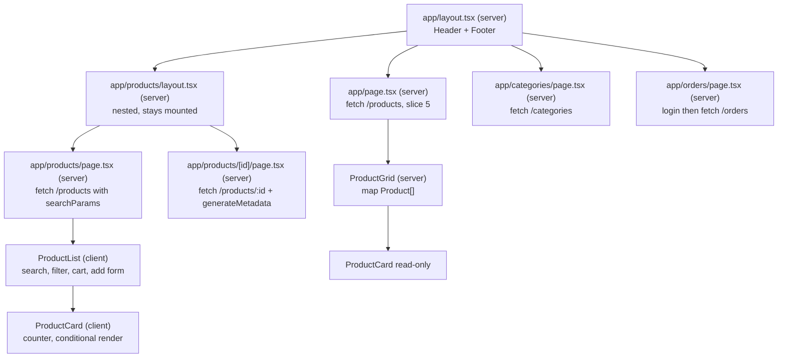

# Design — Checkpoint 2: RevoShop Next.js Frontend

## Overview

A Next.js App Router application that renders the RevoShop storefront from live Flask API data. Server Components fetch on the server; a single Client Component subtree owns the interactive catalog (search, category filter, cart, add-product form).

Guiding constraints:

- **Read-only API integration.** Only `GET` requests. Forms mutate local component state. `POST`/`PUT`/`DELETE`, real auth UX, and checkout belong to Checkpoint 3.
- **One typed model, reused.** The product and category shapes come from the Checkpoint 1 `typescript-tailwind` exercise, which already mirrors the database. The wire format is snake_case; the app model is camelCase; one mapper bridges them.
- **Server Components by default.** `"use client"` appears only where hooks or events are genuinely needed, which keeps the data fetching on the server as the rubric requires.
- **Every fetching route gets `loading.tsx` and `error.tsx`.** Not just the products route.

### Verified API contract

Every line below was confirmed against the deployed API at `https://web-production-03650.up.railway.app` before this design was written.

| Request | Status | Response |
|---|---|---|
| `GET /` | 200 | `{"message": "RevoShop API is running."}` |
| `GET /products` | 200 | bare JSON array, 10 items |
| `GET /products?search=watch` | 200 | 1 item, case-insensitive name match |
| `GET /products?category_id=3` | 200 | 4 items, all `category_id: 3` |
| `GET /products?search=sports&category_id=3` | 200 | 1 item — params combine with AND |
| `GET /products?search=zzzznope` | 200 | `[]` |
| `GET /products/1` | 200 | single object, not wrapped in an array |
| `GET /categories` | 200 | bare array of `{id, name, description}` |
| `GET /orders?user_id=14` (no token) | 401 | `{"code":"authorization_required", ...}` — JWT required |
| `GET /orders?user_id=14` (with token) | 200 | bare array, 3 order headers |
| `GET /orders?user_id=1` (token for user 14) | **403** | reading another user's orders is forbidden |
| `POST /auth/login` (empty body) | 400 | `{"error":"Bad Request","message":"Email and password are required."}` |
| `POST /auth/login` (valid) | 200 | `{access_token, refresh_token, expires_in, refresh_expires_in, token_type, user}` |
| `POST /users` (empty body) | 400 | `{username, email, password}` required; password min 8 chars |

Three consequences:

1. **No `/api` prefix.** `/api/products` returns 404. `NEXT_PUBLIC_API_BASE_URL` is the bare origin with no path segment.
2. **Responses are bare arrays**, never `{data: [...]}`. No envelope unwrapping needed.
3. **Error bodies are not always JSON.** Handled errors return JSON `{error, message}`; unhandled 500s return Flask's HTML error page. A fetch wrapper that calls `res.json()` before checking `res.ok` would surface a JSON parse error instead of the real status.

### Product wire shape

```json
{
  "id": 1,
  "category_id": 2,
  "name": "Nike Air Max Running Shoes",
  "description": "Lightweight and comfortable for jogging",
  "price": 850000.0,
  "stock_quantity": 50,
  "is_delete": false,
  "created_at": "2026-09-03T14:40:31.014048+00:00"
}
```

`price` arrives as a JSON float (`850000.0`), not an integer. It is still whole rupiah; the decimal is an artifact of the serializer. The app model keeps it as `number` and formats with `Intl.NumberFormat` at zero fraction digits, so the `.0` never reaches the screen.

There is no image column, matching Checkpoint 1. Cards render a placeholder image, with the slot already typed so real images drop in later.

### Order wire shape

```json
{
  "id": 33,
  "user_id": 14,
  "status": "PENDING",
  "total_price": 1000000.0,
  "is_delete": false,
  "created_at": "2026-09-30T16:08:32.547001+00:00"
}
```

`GET /orders` returns **order headers only** — no nested line items. So the orders page lists each order's id, status, total, and date; it does not show order contents. `status` is uppercase (`PENDING`), matching the `CUSTOMER` convention seen on users.

### Demo data state

The API is seeded for this checkpoint as follows, so both the populated and empty paths are demonstrable:

| User id | Email | Orders |
|---|---|---|
| 14 | `agus@mail.com` | **3** — totals Rp 1.000.000, Rp 545.000, Rp 890.000 |
| 15 | `nadia@mail.com` | 0 — exercises the empty state |
| 16 | `bayu@mail.com` | 0 — exercises the empty state |

`DEMO_USER_ID` is `14` for the default demo. Pointing it at 15 or 16 renders the orders empty state without any code change, which is how that path gets verified.

Note the earlier `users` rows (ids 1–13) have placeholder `password_hash` values such as `hash_budi_001`, so they cannot authenticate. Only users created through `POST /users` have real hashes.

## Architecture

### Repository layout

The Next.js app lives in a new top-level folder in the existing repository, alongside the Checkpoint 1 exercises. Checkpoint 1 folders are not modified.

```
module-3-alzedmkrom/
├─ html-css/                     # Checkpoint 1, untouched
├─ javascript/                   # Checkpoint 1, untouched
├─ typescript-tailwind/          # Checkpoint 1, untouched
├─ revoshop-app/                 # Checkpoint 2 — the Next.js project
│  ├─ app/
│  │  ├─ layout.tsx              # root layout: Header + Footer + metadata
│  │  ├─ page.tsx                # home: Server Component, first 5 products
│  │  ├─ loading.tsx
│  │  ├─ error.tsx
│  │  ├─ products/
│  │  │  ├─ layout.tsx           # nested layout for the products segment
│  │  │  ├─ page.tsx             # Server Component -> <ProductList />
│  │  │  ├─ loading.tsx
│  │  │  ├─ error.tsx
│  │  │  └─ [id]/
│  │  │     ├─ page.tsx          # detail + generateMetadata
│  │  │     ├─ loading.tsx
│  │  │     └─ error.tsx
│  │  ├─ categories/
│  │  │  ├─ page.tsx             # Server Component fetch
│  │  │  ├─ loading.tsx
│  │  │  └─ error.tsx
│  │  └─ orders/
│  │     ├─ page.tsx             # Server Component fetch, authenticated
│  │     ├─ loading.tsx
│  │     └─ error.tsx
│  ├─ components/
│  │  ├─ Header.tsx              # server
│  │  ├─ Nav.tsx                 # client — usePathname active styling
│  │  ├─ Footer.tsx              # server
│  │  ├─ Card.tsx                # server — presentational wrapper
│  │  ├─ ProductCard.tsx         # client — quantity counter + add to cart
│  │  ├─ ProductGrid.tsx         # server — maps Product[] to cards
│  │  ├─ ProductList.tsx         # client — search, filter, cart, add form
│  │  ├─ SearchBar.tsx           # client — controlled input, router.push
│  │  ├─ CategoryFilter.tsx      # client — dropdown, fetches categories
│  │  ├─ CartSummary.tsx         # client — count + total from cart state
│  │  ├─ AddProductForm.tsx      # client — controlled inputs + validate()
│  │  └─ LayoutMountProbe.tsx    # client — mount-only log, proves no re-render
│  ├─ lib/
│  │  ├─ types.ts                # wire types, app models, props interfaces
│  │  ├─ api.ts                  # fetch wrappers, res.ok checks, ApiError
│  │  ├─ auth.ts                 # server-only login for the orders route
│  │  ├─ format.ts               # rupiah + date formatting
│  │  └─ productStyles.ts        # getButtonClasses and typed class mapping
│  ├─ .env.example               # committed, placeholder values only
│  ├─ .env.local                 # git-ignored, real values
│  └─ (create-next-app config files)
└─ .kiro/specs/                  # requirements, design, tasks
```

Rationale for a subfolder rather than the repository root: the Checkpoint 1 deliverables are graded from this same repository, and scaffolding Next.js at the root would collide with the existing `README.md` and `.gitignore` and bury the earlier exercises. A named subfolder keeps both checkpoints legible, and `npm run dev` from `revoshop-app/` satisfies the deliverable.

### Rendering topology



The server/client boundary sits at `ProductList`. Everything above it renders on the server and fetches data there; everything below is interactive.

### Next.js version constraints

The project targets the current release, Next.js 16.3.7 with React 19.3.0. Two API details differ from most tutorials and from the rubric's wording:

- **`params` and `searchParams` are Promises.** Since Next 15 they must be awaited. The rubric says "using `params.id`"; the correct modern form is `const { id } = await params`. Same inside `generateMetadata`. This satisfies the rubric's intent — the `id` route param drives the fetch and the title — with syntax that actually compiles.
- **`fetch` is not cached by default.** Next 15 removed implicit caching. Each data fetch declares its intent explicitly; this design uses `cache: 'no-store'` so pages always show live data and the `error.tsx` state is reachable by stopping the API.

`useSearchParams()` requires a Suspense boundary in a statically rendered route, so any client component reading it is wrapped in `<Suspense>` by its server parent.

## Data Models

`lib/types.ts` holds three layers: wire types matching the API exactly, app models in idiomatic TypeScript, and component prop interfaces.

```ts
// ---------- wire layer: exactly what the Flask API returns ----------

export interface ProductRecord {
  id: number;
  category_id: number;
  name: string;
  description: string;
  price: number;            // JSON float, e.g. 850000.0
  stock_quantity: number;
  is_delete: boolean;
  created_at: string;       // ISO 8601 with offset
}

export interface CategoryRecord {
  id: number;
  name: string;
  description: string;
}

export interface OrderRecord {
  id: number;
  user_id: number;
  status: string;          // observed: 'PENDING' (uppercase)
  total_price: number;     // JSON float, e.g. 1000000.0
  is_delete: boolean;
  created_at: string;
}

// ---------- app layer: camelCase, the shape components consume ----------

export interface Product {
  id: number;
  categoryId: number;
  name: string;
  description: string;
  price: number;
  stockQuantity: number;
  isDeleted: boolean;
  createdAt: string;
  imageUrl: string | null;   // no image column yet; null drives the placeholder
}

export interface Category {
  id: number;
  name: string;
  description: string;
}

export interface Order {
  id: number;
  userId: number;
  status: OrderStatus;
  totalPrice: number;
  isDeleted: boolean;
  createdAt: string;
}

// Only 'PENDING' is confirmed from live data. Kept open with a string
// fallback so an unseen status renders instead of breaking the page.
export type OrderStatus = 'PENDING' | (string & {});

// Derived stock state — a discriminated union, carried over from Checkpoint 1.
export type Availability =
  | { kind: 'in-stock'; quantity: number }
  | { kind: 'low-stock'; quantity: number }
  | { kind: 'out-of-stock' };

// ---------- component contracts ----------

export interface ProductCardProps {
  product: Product;
  /** Optional: hides the counter and add button for read-only grids. */
  readOnly?: boolean;
  /** Optional: label on the add control. */
  actionLabel?: string;
  /** Optional: omitted in read-only mode. */
  onAddToCart?: (product: Product, quantity: number) => void;
}

export interface CardProps {
  children: React.ReactNode;
  className?: string;
}

// ---------- AddProductForm ----------

export interface FormState {
  name: string;
  description: string;
  price: string;          // raw input strings; parsed during validation
  stockQuantity: string;
  categoryId: string;
}

export type FormErrors = Partial<Record<keyof FormState, string>>;
```

### Mapping and deriving

```ts
export const LOW_STOCK_THRESHOLD = 5;

export function toProduct(record: ProductRecord): Product {
  return {
    id: record.id,
    categoryId: record.category_id,
    name: record.name,
    description: record.description,
    price: record.price,
    stockQuantity: record.stock_quantity,
    isDeleted: record.is_delete,
    createdAt: record.created_at,
    imageUrl: null,
  };
}

export function availabilityOf(product: Product): Availability {
  if (product.stockQuantity <= 0) return { kind: 'out-of-stock' };
  if (product.stockQuantity <= LOW_STOCK_THRESHOLD) {
    return { kind: 'low-stock', quantity: product.stockQuantity };
  }
  return { kind: 'in-stock', quantity: product.stockQuantity };
}
```

`toProduct` is the only place snake_case appears outside the wire types. Components never read `stock_quantity`.

Soft-deleted rows are filtered out after mapping, so an `is_delete: true` product can never render or be added to the cart.

## Components and Interfaces

### Data access layer (`lib/api.ts`)

One module owns every request. Pages never call `fetch` with a raw URL.

```ts
export class ApiError extends Error {
  constructor(
    message: string,
    readonly status: number,
    readonly url: string,
  ) {
    super(message);
    this.name = 'ApiError';
  }
}

function baseUrl(): string {
  const base = process.env.NEXT_PUBLIC_API_BASE_URL;
  if (!base) {
    throw new Error('NEXT_PUBLIC_API_BASE_URL is not set. Copy .env.example to .env.local.');
  }
  return base.replace(/\/$/, '');
}

async function fetchJson<T>(path: string, init?: RequestInit): Promise<T> {
  const url = `${baseUrl()}${path}`;
  const res = await fetch(url, { cache: 'no-store', ...init });

  // res.ok is checked BEFORE parsing. A 500 from Flask returns HTML, so
  // parsing first would throw a misleading JSON syntax error.
  if (!res.ok) {
    throw new ApiError(await describeFailure(res), res.status, url);
  }
  return (await res.json()) as T;
}
```

`describeFailure` attempts a JSON parse to recover the API's `{error, message}` body and falls back to the status text when the body is HTML. This is what makes the thrown error useful in `error.tsx`.

Exported helpers, each returning app models rather than wire records:

| Function | Request | Returns |
|---|---|---|
| `getProducts({ search?, categoryId? })` | `GET /products` with optional query params | `Product[]` |
| `getProduct(id)` | `GET /products/:id` | `Product` |
| `getCategories()` | `GET /categories` | `Category[]` |
| `getOrders(userId)` | `GET /orders?user_id=` with Bearer token | `Order[]` |

`getProducts` builds its query string with `URLSearchParams`, omitting empty values, so `getProducts({})` requests a clean `/products`.

### Authenticated orders (`lib/auth.ts`)

The orders endpoint requires a JWT, but user-facing authentication is Checkpoint 3. The resolution, agreed before design: the **Server Component authenticates server-side** with demo credentials held in environment variables, then calls `/orders` with the bearer token. The token is created and used on the server and never reaches the browser.

```ts
import 'server-only';   // build-time guard: importing this from a client component fails
```

Flow:

1. `POST /auth/login` with `{ email, password }` read from `DEMO_USER_EMAIL` / `DEMO_USER_PASSWORD`.
2. Read `access_token` from the response and cache it in module scope alongside its expiry, derived from `expires_in`.
3. Attach `Authorization: Bearer <access_token>` to the `/orders` request.
4. On a 401, discard the cached token, retry the login once, then fail with an `ApiError`.

Login response shape, confirmed against a real login:

```
access_token, refresh_token, expires_in, refresh_expires_in, token_type, user
```

Only `access_token` and `expires_in` are used. `refresh_token` is deliberately ignored — token refresh is Checkpoint 3 territory, and re-logging in is simpler and sufficient for a short-lived demo request.

Three notes carried into implementation:

- **`user_id` must match the authenticated user.** A token for user 14 requesting `/orders?user_id=1` returns **403**, verified. So `getOrders` sends the id of the user it logged in as, read from `DEMO_USER_ID`, rather than an arbitrary id.
- **In-memory token caching is per server process.** Adequate for a local demo; a real deployment would use a shared cache. Called out so the limitation is deliberate, not accidental.
- **The orders empty state is a real path, not a fallback.** Users 15 and 16 have no orders, so switching `DEMO_USER_ID` renders it on demand.

`API_SECRET_KEY` is also defined as a server-only variable per the rubric. It is never prefixed `NEXT_PUBLIC_`, so it cannot be bundled into client JavaScript.

### Layouts

**`app/layout.tsx`** — root. Exports `metadata`, renders `<html>`/`<body>`, and wraps `{children}` with `<Header />` and `<Footer />`. Because the root layout supplies the chrome, no page renders `Header` or `Footer` itself.

**`app/products/layout.tsx`** — nested. Wraps the products segment with a segment heading and renders `<LayoutMountProbe label="products layout" />`.

`LayoutMountProbe` is a tiny client component whose only job is a `useEffect` with an empty dependency array that logs once on mount. Navigating `/products` to `/products/3` and back must produce exactly one log line, which is the observable proof the nested layout stays mounted rather than remounting.

### Presentational components

**`Card`** — a server component taking `children` and an optional `className`. Owns the shared surface: border, radius, padding, shadow. Every card-shaped surface in the app composes it, so the container style exists once.

**`ProductCard`** — a client component (it owns the quantity counter). Consumes `ProductCardProps`, composes `Card`, and applies the conditional rendering:

```tsx
export default function ProductCard({
  product,
  readOnly = false,
  actionLabel = 'Add to cart',
  onAddToCart,
}: ProductCardProps) { /* ... */ }
```

Three optional props with destructuring defaults, satisfying the "optional props with default values" requirement. `readOnly` is what lets the home page render the same component without interactivity.

Conditional rendering inside the card:

| Condition | Rendered |
|---|---|
| `availability.kind === 'out-of-stock'` | disabled control, "Out of stock" label, red badge |
| `availability.kind === 'low-stock'` | enabled control, "Only N left" amber badge |
| `availability.kind === 'in-stock'` | enabled control, "In stock (N)" emerald badge |
| `readOnly === true` | counter and add control omitted entirely |
| `imageUrl === null` | placeholder image |

**`getButtonClasses(inStock: boolean): string`** lives in `lib/productStyles.ts` and returns a complete literal Tailwind string per branch:

```ts
export function getButtonClasses(inStock: boolean): string {
  return inStock
    ? 'w-full rounded-md bg-blue-600 px-4 py-2 font-semibold text-white transition-colors hover:bg-blue-700 focus-visible:ring-2 focus-visible:ring-blue-400'
    : 'w-full cursor-not-allowed rounded-md bg-slate-200 px-4 py-2 font-semibold text-slate-400';
}
```

Both branches are whole literal strings. Tailwind resolves classes by scanning source text, so a class assembled by interpolation would produce no CSS.

**`ProductGrid`** — a server component receiving `products: Product[]` and rendering a single `.map()` into `ProductCard`. No repeated or hardcoded card instances anywhere in the codebase.

### Navigation (`components/Nav.tsx`)

A client component, because `usePathname()` is a hook.

```tsx
const links = [
  { href: '/', label: 'Home' },
  { href: '/products', label: 'Products' },
  { href: '/categories', label: 'Categories' },
  { href: '/orders', label: 'Orders' },
];

const pathname = usePathname();
const isActive = (href: string) =>
  href === '/' ? pathname === '/' : pathname.startsWith(href);
```

Exact match for the home link, prefix match elsewhere, so `/products/3` still highlights "Products". The active link gets distinct classes plus `aria-current="page"`, so the state is conveyed to assistive technology and not by colour alone.

### Interactive catalog (`components/ProductList.tsx`)

The single Client Component subtree, marked `"use client"`, receiving `products: Product[]` and `categories: Category[]` from its Server Component parent.

State it owns:

```ts
const [items, setItems] = useState<Product[]>(initialProducts);
const [cart, setCart] = useState<Product[]>([]);
const [categoryId, setCategoryId] = useState<number | null>(null);
const [isPending, setIsPending] = useState(false);
const [fetchError, setFetchError] = useState<string | null>(null);
```

Behaviour:

- **Search by URL.** `SearchBar` is controlled; on Enter it calls `router.push(\`/products?search=${encodeURIComponent(query)}\`)`.
- **Reacting to the URL.** A `useEffect` reads `useSearchParams()`, and on every change to the `search` value fetches `GET /products?search=${query}` and replaces `items`. Because the effect is keyed on the query string, a direct load of `/products?search=watch` renders already filtered.
- **Category filter.** `CategoryFilter` receives categories as a prop from the server parent for first paint, and also fetches `GET /categories` on mount to satisfy the rubric's explicit "fetches on mount" wording. Selecting a category refetches `GET /products?category_id=${id}`.
- **Add to cart, immutably.** `setCart((prev) => [...prev, product])`. Never `push`.
- **Cart summary.** `CartSummary` derives count and total from cart state on every render with `reduce`, so the displayed figures cannot drift from the array.
- **Add product.** `AddProductForm` on valid submit calls `setItems((prev) => [newProduct, ...prev])` — the immutable spread pattern the rubric names.

Pending and error states are surfaced, so a slow or failed client fetch never looks like a frozen or silently empty list.

### AddProductForm and validation

Controlled inputs for name, description, price, stock quantity, and category. Values are held as strings in `FormState` because that is what inputs produce; parsing happens in validation.

```ts
export function validate(data: FormState): FormErrors {
  const errors: FormErrors = {};

  if (!data.name.trim()) errors.name = 'Name is required.';
  else if (data.name.trim().length < 3) errors.name = 'Name must be at least 3 characters.';

  if (!data.description.trim()) errors.description = 'Description is required.';

  const price = Number(data.price);
  if (!data.price.trim()) errors.price = 'Price is required.';
  else if (!Number.isFinite(price) || price <= 0) errors.price = 'Price must be a positive number.';

  const stock = Number(data.stockQuantity);
  if (!data.stockQuantity.trim()) errors.stockQuantity = 'Stock quantity is required.';
  else if (!Number.isInteger(stock) || stock < 0) errors.stockQuantity = 'Stock must be zero or a positive whole number.';

  if (!data.categoryId) errors.categoryId = 'Choose a category.';

  return errors;
}
```

Submission calls `preventDefault()` first, runs `validate`, and proceeds only when the returned object has no keys. Each message renders directly beneath its own input, wired with `aria-describedby` and `aria-invalid`. Entered values survive a failed validation.

### Route implementations

**`app/page.tsx`** — pure Server Component. `await getProducts({})`, `slice(0, 5)`, render through `ProductGrid` with `readOnly`. No `"use client"` anywhere in its tree.

**`app/products/page.tsx`** — Server Component. Awaits `searchParams`, fetches the initial product set honouring any `search` parameter, fetches categories, and renders `<ProductList />` inside `<Suspense>` (required because the child reads `useSearchParams`).

**`app/products/[id]/page.tsx`** — Server Component plus `generateMetadata`:

```tsx
export async function generateMetadata(
  { params }: { params: Promise<{ id: string }> },
): Promise<Metadata> {
  const { id } = await params;
  try {
    const product = await getProduct(Number(id));
    return { title: `${product.name} — RevoShop`, description: product.description };
  } catch {
    return { title: `Product ${id} — RevoShop` };
  }
}
```

The dynamic title uses the real product name, with the `id` param as the fallback so a failed metadata fetch degrades instead of breaking the page.

**`app/categories/page.tsx`** and **`app/orders/page.tsx`** — each independently applies the same Server Component fetch pattern, to `getCategories()` and `getOrders(demoUserId)` respectively.

## Correctness Properties

Properties that must hold, written so they can be checked by interaction.

### Property 1: Server Components never ship client code

**Validates: Requirements 12.1, 12.2**

`app/page.tsx` and its rendered tree contain no `"use client"` directive and no hooks. The home page's product cards are read-only, so no interactivity is required there.

### Property 2: The wire format never escapes the mapper

**Validates: Requirements 2.5, 12.6**

No component or page reads a snake_case field. `stock_quantity`, `category_id`, and `is_delete` appear only in `lib/types.ts` and `lib/api.ts`.

### Property 3: Failure is checked before parsing

**Validates: Requirements 14.1, 14.5**

Every response has `res.ok` tested before any `res.json()` call, so a Flask HTML 500 surfaces as an `ApiError` carrying the real status rather than a JSON syntax error.

### Property 4: Every fetching route has both states

**Validates: Requirements 14.2, 14.3, 14.4**

Each of `/`, `/products`, `/products/[id]`, `/categories`, `/orders` has a sibling `loading.tsx` and `error.tsx`. Stopping the API renders the error UI on every one of them, never a blank page or an unhandled exception.

### Property 5: The nested layout survives navigation

**Validates: Requirement 7.4**

Navigating `/products` to `/products/[id]` and back logs the products-layout mount exactly once. A second log line would mean the layout remounted.

### Property 6: Search is URL-driven and reload-safe

**Validates: Requirements 9.1, 9.2, 9.3, 9.4**

Pressing Enter changes the URL to `/products?search=<q>`. Loading that URL directly renders the same filtered list as typing the query. The search input displays the active query in both cases.

### Property 7: Cart state is only ever replaced, never mutated

**Validates: Requirements 6.3, 6.6**

Every cart and product-list update produces a new array via spread. No `push`, `splice`, `sort`, or element assignment is applied to a state value.

### Property 8: Summary figures are derived, not accumulated

**Validates: Requirement 6.4**

Cart count and total are recomputed from cart state on each render, so they cannot drift from the array's contents.

### Property 9: Stock state gates interaction

**Validates: Requirements 3.2, 3.4**

An out-of-stock product cannot be added: its control is `disabled`, not merely styled differently. The quantity counter stays within `0` and `stockQuantity` inclusive.

### Property 10: Tailwind classes are complete literals

**Validates: Requirements 3.5, 3.6**

`getButtonClasses` and every class-returning helper return whole literal strings. No class name is assembled by interpolating a variable.

### Property 11: Secrets stay server-side

**Validates: Requirements 10.2, 10.3**

`API_SECRET_KEY`, `DEMO_USER_EMAIL`, and `DEMO_USER_PASSWORD` carry no `NEXT_PUBLIC_` prefix and are read only in modules importing `server-only`. The committed `.env.example` holds placeholders; the file with real values is git-ignored.

### Property 12: The product grid has exactly one card call site

**Validates: Requirements 4.2**

`ProductCard` is instantiated from a single `.map()` in `ProductGrid`. No route or component contains a second, hardcoded card.

### Property 13: Soft-deleted products never appear

**Validates: Requirement 12.6**

Rows with `is_delete: true` are filtered out after mapping, so they cannot render, be searched, or be added to the cart. The same flag exists on orders and is filtered the same way.

### Property 14: Orders are requested only for the authenticated user

**Validates: Requirements 12.5, 10.2**

`getOrders` sends the id of the account it logged in as. Requesting another user's orders returns 403, verified against the live API, so a mismatch between `DEMO_USER_ID` and `DEMO_USER_EMAIL` surfaces as a clear authorization error rather than as silently empty data.

### Property 15: The orders empty state is reachable

**Validates: Requirements 14.4, 15.4**

Switching `DEMO_USER_ID` to 15 or 16 renders the orders empty state, because those accounts genuinely have no orders. The empty state is therefore verified against real data rather than mocked.

## Error Handling

| Layer | Mechanism |
|---|---|
| Missing env var | `baseUrl()` throws a message naming the variable and pointing at `.env.example` |
| Non-2xx response | `ApiError` with status, URL, and the API's own `message` when the body is JSON |
| HTML error body | `describeFailure` falls back to status text instead of a parse error |
| Server render failure | Route-segment `error.tsx`, a client component with a `reset()` retry button |
| Slow fetch | Route-segment `loading.tsx` skeleton matching the real layout's shape |
| Client fetch failure | Inline recoverable message inside `ProductList`, list left intact |
| Expired orders token | One silent re-login, then a surfaced `ApiError` |
| Missing product id | `getProduct` on a 404 throws; the detail route's `error.tsx` catches it |
| Form validation | Per-field messages from `validate`, values preserved |

`error.tsx` files never show a raw stack trace. They show a short human sentence, the failing resource, and a retry control.

## Testing Strategy

No test framework is introduced. The rubric is verified by interaction, and the checkpoint asks for a working app plus demo evidence rather than a suite. Verification is therefore explicit, with automated gates where they exist.

**Automated:**

- `npx tsc --noEmit` exits 0.
- `npm run build` completes without errors.
- `npm run lint` passes.

**Manual, per route:**

1. **Home** — five product cards, real names and prices from the API, no interactive controls.
2. **Products** — cards render; typing and pressing Enter changes the URL and filters the list; reloading that URL stays filtered; the category dropdown filters; combining search and category narrows further.
3. **Product detail** — real data; the browser tab title shows the actual product name; a bad id shows the error UI.
4. **Categories** — four categories from the API.
5. **Orders** — three live orders for user 14 with correct totals (Rp 1.000.000, Rp 545.000, Rp 890.000); no token value appears in the browser's network tab or page source. Then set `DEMO_USER_ID=15`, reload, and confirm the empty state renders.
6. **Navigation** — the current route's link is highlighted and carries `aria-current`; `/products/3` still highlights Products.
7. **Nested layout** — navigate products to detail and back; exactly one mount log.
8. **Loading and error** — throttle the network to see each skeleton; stop the API (or point the base URL at a dead host) to see each `error.tsx`.
9. **Catalog interactions** — add to cart updates count and total; quantity clamps at 0 and at stock; out-of-stock card cannot be added; `AddProductForm` rejects invalid input with per-field messages and prepends a valid product to the list.

Demo evidence for Requirement 15 is captured during this pass.

## Environment configuration

`.env.example` — committed, placeholders only:

```
# Public: exposed to the browser, safe to publish
NEXT_PUBLIC_API_BASE_URL=https://web-production-03650.up.railway.app

# Server-only: never prefixed NEXT_PUBLIC_, never committed with real values.
# The orders route logs in with these to obtain a JWT server-side.
API_SECRET_KEY=replace-me
DEMO_USER_EMAIL=replace-me@example.com
DEMO_USER_PASSWORD=replace-me
# Must be the id of DEMO_USER_EMAIL's account: the API returns 403 for any
# other user's orders. 14 has seeded orders; 15 and 16 are empty.
DEMO_USER_ID=14
```

`.env.local` holds the real values and is already git-ignored by `create-next-app`'s default `.gitignore`. A task verifies that ignore rule rather than assuming it.

## Commit plan

_Requirement 1.6 — incremental history in the order scaffold, components, routing, API integration._

| # | Scope | Message |
|---|---|---|
| 1 | scaffold | `chore(app): scaffold next.js project with typescript and tailwind` |
| 2 | env + types | `feat(app): add typed API models and environment configuration` |
| 3 | data layer | `feat(app): add API client with typed errors and response mapping` |
| 4 | chrome | `feat(app): add Header, Footer, Nav and Card components` |
| 5 | cards | `feat(app): add ProductCard with quantity counter and conditional rendering` |
| 6 | grid | `feat(app): render product grid from a mapped Product array` |
| 7 | layouts | `feat(app): add root and nested products layouts with metadata` |
| 8 | home | `feat(app): fetch products in a Server Component for the home page` |
| 9 | products route | `feat(app): add products route with URL-driven search and category filter` |
| 10 | detail | `feat(app): add product detail route with generateMetadata` |
| 11 | categories + orders | `feat(app): add categories and authenticated orders routes` |
| 12 | states | `feat(app): add loading and error boundaries to every fetching route` |
| 13 | catalog | `feat(app): add cart, cart summary and AddProductForm with validation` |
| 14 | docs | `docs(app): document setup, routes and demo evidence` |

## Requirements traceability

| Requirement | Satisfied by |
|---|---|
| 1.1 – 1.6 | `create-next-app` scaffold, `revoshop-app/` layout, commit plan |
| 2.1 – 2.5 | `components/` set, `ProductCardProps`, `Card`, reused Checkpoint 1 model |
| 3.1 – 3.6 | `ProductCard` counter and conditional branches, `getButtonClasses` |
| 4.1 – 4.3 | Root layout chrome, `ProductGrid` single `.map()` |
| 5.1 – 5.7 | `SearchBar`, `AddProductForm`, `validate(FormState): FormErrors` |
| 6.1 – 6.6 | `ProductList` state, immutable spreads, `CartSummary` |
| 7.1 – 7.4 | `app/` route files, root and nested layouts, `LayoutMountProbe` |
| 8.1 – 8.4 | `Nav` with `usePathname`, active classes, `aria-current` |
| 9.1 – 9.4 | `router.push`, `useSearchParams` effect keyed on the query |
| 10.1 – 10.4 | `.env.example`, `baseUrl()` guard, `server-only` imports |
| 11.1 – 11.4 | `metadata` exports, `generateMetadata` fetching the real name |
| 12.1 – 12.6 | Server Component fetches on all four routes, `toProduct` mapping |
| 13.1 – 13.7 | `ProductList` client component, search effect, `CategoryFilter` |
| 14.1 – 14.5 | `res.ok` check, `ApiError`, per-route `loading.tsx` and `error.tsx` |
| 15.1 – 15.7 | Manual verification pass and captured demo evidence |
