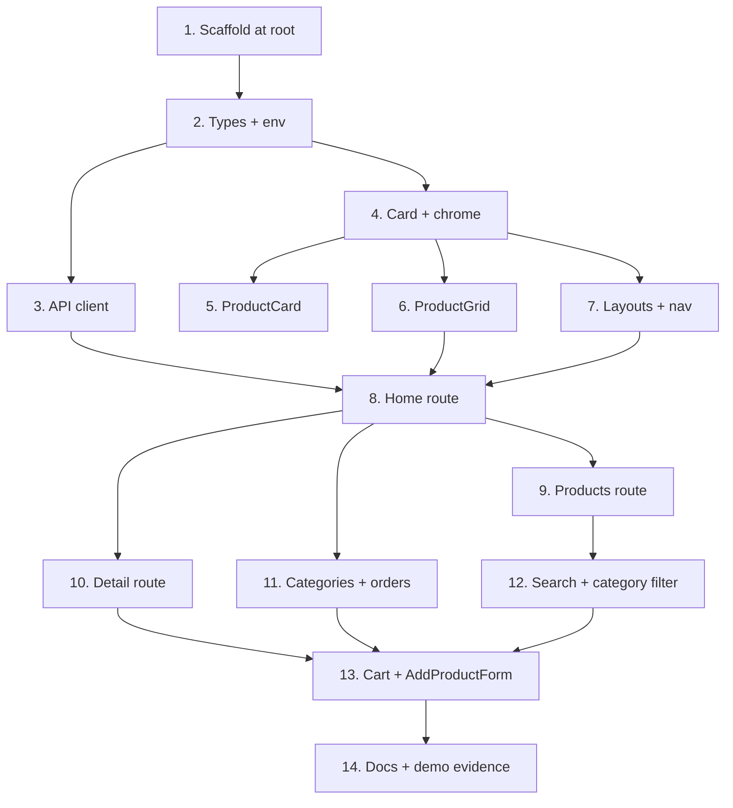

# Implementation Plan

## Overview

Fourteen commits in dependency order: scaffold, then the typed data layer, then components, then routing, then API integration, then the interactive catalog, then docs and demo evidence. The assignment grades incremental history, so each top-level task ends at a commit boundary.

The tip "build one route fully end-to-end before moving to the next" shapes tasks 8 through 12: each route lands with its page, its `loading.tsx`, and its `error.tsx` together rather than deferring the states to a cleanup pass.

The API is live and already probed, so every fetch target and response shape in these tasks is known rather than assumed.

## Task Dependency Graph

```json
{
  "waves": [
    { "wave": 1, "tasks": ["1"], "dependsOn": [] },
    { "wave": 2, "tasks": ["2"], "dependsOn": ["1"] },
    { "wave": 3, "tasks": ["3", "4"], "dependsOn": ["2"] },
    { "wave": 4, "tasks": ["5", "6"], "dependsOn": ["4"] },
    { "wave": 5, "tasks": ["7"], "dependsOn": ["4"] },
    { "wave": 6, "tasks": ["8"], "dependsOn": ["3", "6", "7"] },
    { "wave": 7, "tasks": ["9", "10", "11"], "dependsOn": ["8"] },
    { "wave": 8, "tasks": ["12"], "dependsOn": ["9"] },
    { "wave": 9, "tasks": ["13"], "dependsOn": ["10", "11", "12"] },
    { "wave": 10, "tasks": ["14"], "dependsOn": ["13"] }
  ]
}
```



Task 1 gates everything. The data layer (3) and the presentation layer (4, 5, 6, 7) are independent once types exist, so they can proceed in either order. Routes 9, 10 and 11 are siblings and independent of each other once the home route proves the fetch pattern.

## Tasks

- [x] 1. Scaffold the Next.js project at the repository root
- [x] 1.1 Run create-next-app into a temporary directory
  - Run `npx create-next-app@latest .next-scaffold --typescript --tailwind --app --eslint --no-src-dir --use-npm`
  - Use `--no-src-dir` so `app/`, `components/` and `lib/` live at the root, matching the deliverable's `components/` folder wording
  - Confirm the generated project uses Next 16.x and React 19.x
  - _Requirements: 1.1, 1.4_

- [x] 1.2 Move the scaffold to the repository root without destroying existing files
  - Move everything from `.next-scaffold/` into the root **except** `README.md` and `.gitignore`
  - Merge the generated `.gitignore` entries (`.next/`, `node_modules/`, `/out/`, `.env*.local`, `*.tsbuildinfo`) into the existing `.gitignore` rather than overwriting it
  - Delete `.next-scaffold/`
  - Verify `.kiro/specs/` is untouched and still contains both checkpoint folders
  - Verify `.env*.local` is matched by `.gitignore` using `git check-ignore -v .env.local`
  - _Requirements: 1.3_

- [x] 1.3 Verify the dev server and build both run clean
  - Run `npm run dev` and confirm the default page renders with no terminal or browser console errors, then stop it
  - Run `npx tsc --noEmit`, `npm run lint`, and `npm run build` and confirm all three exit without errors
  - Commit: `chore(app): scaffold next.js project with typescript and tailwind`
  - _Requirements: 1.2, 1.5_

- [x] 2. Define types and environment configuration
- [x] 2.1 Write `lib/types.ts`
  - Define the wire types `ProductRecord`, `CategoryRecord` and `OrderRecord` with the exact snake_case fields the API returns, including `is_delete` on both products and orders
  - Define the app models `Product`, `Category` and `Order` in camelCase
  - Define `OrderStatus` as `'PENDING' | (string & {})`, since only `PENDING` is confirmed from live data
  - Define the `Availability` discriminated union and `LOW_STOCK_THRESHOLD`
  - Define `ProductCardProps` with at least one optional prop, plus `CardProps`, `FormState` and `FormErrors`
  - Write `toProduct`, `toCategory`, `toOrder` and `availabilityOf`
  - Type `price` and `total_price` as `number`; the API returns JSON floats such as `850000.0`
  - _Requirements: 2.2, 2.3, 2.5, 5.3_

- [x] 2.2 Add environment configuration
  - Create `.env.example` at the root with `NEXT_PUBLIC_API_BASE_URL`, `API_SECRET_KEY`, `DEMO_USER_EMAIL`, `DEMO_USER_PASSWORD` and `DEMO_USER_ID`, all placeholders
  - Create `.env.local` with the real values, including `DEMO_USER_ID=14`, and confirm it is git-ignored
  - Add a comment in `.env.example` noting `DEMO_USER_ID` must match `DEMO_USER_EMAIL`'s account, because the API returns 403 for another user's orders
  - Keep every server-only variable free of the `NEXT_PUBLIC_` prefix
  - _Requirements: 10.1, 10.2, 10.3_

- [x] 2.3 Add the rupiah and date formatters
  - Write `lib/format.ts` with a rupiah formatter using `Intl.NumberFormat('id-ID')` at zero fraction digits, so `850000.0` renders as `Rp 850.000`
  - Add a short date formatter for order `createdAt`
  - Commit: `feat(app): add typed API models and environment configuration`
  - _Requirements: 2.5_

- [x] 3. Build the API client
- [x] 3.1 Write `lib/api.ts` with a typed error and a guarded fetch
  - Define `ApiError` carrying `message`, `status` and `url`
  - Write `baseUrl()` reading `NEXT_PUBLIC_API_BASE_URL`, throwing a message that names the variable when it is missing, and stripping any trailing slash
  - Write `fetchJson<T>` that checks `res.ok` **before** calling `res.json()`, and throws `ApiError` on failure
  - Write a `describeFailure` helper that tries to read the API's JSON `{error, message}` body and falls back to status text, because unhandled 500s return HTML rather than JSON
  - Default every request to `cache: 'no-store'` so pages show live data and the error states stay reachable
  - _Requirements: 14.1_

- [x] 3.2 Add the read helpers
  - `getProducts({ search?, categoryId? })` building its query string with `URLSearchParams` and omitting empty values, so an empty argument requests a clean `/products`
  - `getProduct(id)` hitting `/products/:id`, which returns a single object rather than an array
  - `getCategories()` hitting `/categories`
  - Map every response through the `toProduct` / `toCategory` functions and filter out rows with `isDeleted` true
  - Commit: `feat(app): add API client with typed errors and response mapping`
  - _Requirements: 12.1, 12.6_

- [x] 4. Build the shared chrome and Card wrapper
- [x] 4.1 Write the `Card` wrapper
  - Create `components/Card.tsx` as a server component accepting `children` and an optional `className`
  - Own the shared surface styling here — border, radius, padding, shadow — so no other component repeats it
  - _Requirements: 2.4_

- [x] 4.2 Write `Header`, `Footer` and `Nav`
  - Create `components/Header.tsx` and `components/Footer.tsx` as server components
  - Create `components/Nav.tsx` as a client component with `"use client"`, linking `/`, `/products`, `/categories` and `/orders`
  - Determine the active route with `usePathname()`, using an exact match for `/` and a prefix match elsewhere so `/products/3` still highlights Products
  - Give the active link distinct styling plus `aria-current="page"`, so the state is not conveyed by colour alone
  - Commit: `feat(app): add Header, Footer, Nav and Card components`
  - _Requirements: 2.1, 8.1, 8.2, 8.3, 8.4_

- [x] 5. Build ProductCard
- [x] 5.1 Add the typed class mapping
  - Write `lib/productStyles.ts` with `getButtonClasses(inStock: boolean): string` returning a different complete literal Tailwind string per branch
  - Add an availability badge class mapping driven by the `Availability` union, with a `never` exhaustiveness check
  - Write every class as a whole literal string; never assemble one by interpolating a variable, since Tailwind resolves classes by scanning source text
  - _Requirements: 3.5, 3.6_

- [x] 5.2 Implement the card
  - Create `components/ProductCard.tsx` as a client component consuming `ProductCardProps` and composing `Card`
  - Destructure with defaults: `readOnly = false`, `actionLabel = 'Add to cart'`
  - Implement the quantity counter, clamped so it cannot drop below zero or exceed `stockQuantity`
  - Render conditionally on availability: badge text and colour per state, and a disabled control when out of stock
  - Omit the counter and add control entirely when `readOnly` is true
  - Render a placeholder image, since the products table has no image column
  - Commit: `feat(app): add ProductCard with quantity counter and conditional rendering`
  - _Requirements: 2.3, 3.1, 3.2, 3.3, 3.4_

- [x] 6. Build ProductGrid
  - Create `components/ProductGrid.tsx` as a server component taking `products: Product[]`
  - Render the cards from a single `.map()`; no hardcoded or repeated `ProductCard` instances anywhere in the codebase
  - Lay the grid out mobile-first, adding columns at `sm` and `lg`
  - Render an empty state when the array is empty, so a filtered-to-nothing list never collapses the layout
  - Commit: `feat(app): render product grid from a mapped Product array`
  - _Requirements: 4.1, 4.2_

- [x] 7. Build the layouts
- [x] 7.1 Write the root layout
  - Create `app/layout.tsx` wrapping every page with `<Header />` and `<Footer />`
  - Export `metadata` with `title` and `description`
  - Keep `Header` and `Footer` out of individual pages, so they are never duplicated
  - _Requirements: 7.2, 11.1, 4.3_

- [x] 7.2 Write the nested products layout and its mount probe
  - Create `app/products/layout.tsx` wrapping the products segment
  - Create `components/LayoutMountProbe.tsx` as a client component whose only behaviour is a `useEffect` with an empty dependency array that logs once on mount
  - Render the probe from the products layout
  - Commit: `feat(app): add root and nested products layouts with metadata`
  - _Requirements: 7.3_

- [x] 8. Build the home route end to end
  - Create `app/page.tsx` as a pure Server Component: `await getProducts({})`, take the first five, render through `ProductGrid` with `readOnly`
  - Confirm no `"use client"` directive and no hooks appear anywhere in this page's own tree
  - Export `metadata` with `title` and `description`
  - Create `app/loading.tsx` with a skeleton matching the grid's shape
  - Create `app/error.tsx` as a client component showing a friendly message and a `reset()` retry control, never a raw stack trace
  - Verify five real products render with live names and prices
  - Commit: `feat(app): fetch products in a Server Component for the home page`
  - _Requirements: 11.2, 12.1, 12.2, 14.2, 14.3, 14.4, 15.1_

- [x] 9. Build the products route end to end
  - Create `app/products/page.tsx` as a Server Component that awaits `searchParams` (a Promise in Next 15+), fetches the initial products honouring any `search` value, and fetches categories
  - Render `<ProductList />` inside `<Suspense>`, required because the child reads `useSearchParams()`
  - Export `metadata` with `title` and `description`
  - Create `app/products/loading.tsx` with a skeleton UI
  - Create `app/products/error.tsx` as a client component with a friendly UI and retry
  - Commit: `feat(app): add products route with loading and error states`
  - _Requirements: 7.1, 11.2, 13.1, 14.2, 14.3_

- [x] 10. Build the product detail route end to end
  - Create `app/products/[id]/page.tsx` as a Server Component, awaiting `params` and fetching via `getProduct(id)`
  - Implement `generateMetadata({ params })` that awaits `params`, fetches the product, and uses the real product name as the title, falling back to the id when the fetch fails
  - Create `app/products/[id]/loading.tsx` and `app/products/[id]/error.tsx`
  - Verify the browser tab shows the real product name, and that an unknown id renders the error UI rather than crashing
  - Verify the nested layout stays mounted: navigate `/products` to `/products/3` and back, and confirm the mount probe logs exactly once
  - Commit: `feat(app): add product detail route with generateMetadata`
  - _Requirements: 7.4, 11.3, 11.4, 12.3, 14.4, 15.3_

- [x] 11. Build the categories and orders routes end to end
- [x] 11.1 Build the categories route
  - Create `app/categories/page.tsx` as a Server Component calling `getCategories()`
  - Export `metadata`, and add `loading.tsx` and `error.tsx` for the segment
  - Verify the four real categories render
  - _Requirements: 11.2, 12.4, 14.4, 15.4_

- [x] 11.2 Add server-side authentication for orders
  - Create `lib/auth.ts` beginning with `import 'server-only'`, so importing it from a client component fails the build
  - `POST /auth/login` with `{ email, password }` from `DEMO_USER_EMAIL` and `DEMO_USER_PASSWORD`, and read `access_token` from the response
  - Cache the token in module scope with an expiry derived from `expires_in`; ignore `refresh_token`, since refresh is Checkpoint 3 scope
  - On a 401, discard the cached token, retry the login once, then fail with an `ApiError`
  - _Requirements: 10.2_

- [x] 11.3 Build the orders route
  - Add `getOrders(userId)` to the API client, sending `Authorization: Bearer <access_token>` and `?user_id=`
  - Send the id of the account that was logged in, read from `DEMO_USER_ID`, because the API returns 403 for another user's orders
  - Create `app/orders/page.tsx` as a Server Component rendering each order's id, status, total and date — the API returns order headers only, with no nested line items
  - Export `metadata`, and add `loading.tsx` and `error.tsx` for the segment
  - Render an empty state for an account with no orders
  - Verify user 14 shows three orders totalling Rp 1.000.000, Rp 545.000 and Rp 890.000, then switch `DEMO_USER_ID` to 15 and confirm the empty state renders
  - Confirm no token value appears in the browser network tab or page source
  - Commit: `feat(app): add categories and authenticated orders routes`
  - _Requirements: 11.2, 12.5, 14.4, 15.4_

- [x] 12. Wire URL-driven search and the category filter
- [x] 12.1 Build the SearchBar
  - Create `components/SearchBar.tsx` as a controlled client component holding its value in state and updating it through an `onChange` handler
  - On Enter, call `router.push('/products?search=' + encodeURIComponent(query))`
  - _Requirements: 5.1, 9.1_

- [x] 12.2 Build the CategoryFilter
  - Create `components/CategoryFilter.tsx` as a client component that fetches `GET /categories` on mount, accepting the server-fetched list as a prop for first paint
  - On selection, trigger a refetch of `GET /products?category_id=${id}`
  - _Requirements: 13.4, 13.5_

- [x] 12.3 Build the ProductList client component
  - Create `components/ProductList.tsx` with `"use client"`, accepting `products: Product[]` and `categories: Category[]` from its Server Component parent
  - Add a `useEffect` reading `useSearchParams()` that fetches `GET /products?search=${query}` whenever the query changes, and replaces the rendered list
  - Display the current search value, so a direct load of `/products?search=watch` renders already filtered and shows the term
  - Surface a pending indicator while a client fetch is in flight, and a recoverable message when one fails
  - Verify search and category filter independently, then combined — the API supports both params together with AND
  - Commit: `feat(app): add URL-driven search and category filtering`
  - _Requirements: 9.2, 9.3, 9.4, 13.1, 13.2, 13.3, 13.6, 13.7, 15.2_

- [x] 13. Build the interactive catalog
- [x] 13.1 Add cart state and summary
  - Hold `cart` as `Product[]` state in `ProductList`
  - Add to cart with `setCart((prev) => [...prev, product])`; never `push`, `splice` or element assignment
  - Create `components/CartSummary.tsx` deriving item count and total from cart state with `reduce` on every render, so the figures cannot drift
  - Confirm an out-of-stock product cannot be added, because its control is disabled
  - _Requirements: 6.1, 6.3, 6.4, 6.6_

- [x] 13.2 Build AddProductForm with validation
  - Create `components/AddProductForm.tsx` with controlled inputs for name, description, price, stock quantity and category, each bound to `FormState`
  - Write `validate(data: FormState): FormErrors` returning per-field messages for empty, too-short, non-numeric and non-positive values
  - Call `preventDefault()` first on submit, then validate, and proceed only when no errors are returned
  - Render each error message directly below its own input, wired with `aria-describedby` and `aria-invalid`
  - Preserve entered values when validation fails
  - Append a valid product with `setItems((prev) => [newProduct, ...prev])` and confirm it appears in the rendered list
  - Issue no `POST` request; this checkpoint is local state only
  - Commit: `feat(app): add cart, cart summary and AddProductForm with validation`
  - _Requirements: 5.2, 5.4, 5.5, 5.6, 5.7, 6.2, 6.5_

- [x] 14. Document and capture demo evidence
- [x] 14.1 Update the README
  - Describe the project, the component and route structure, and the separation between `app/`, `components/` and `lib/`
  - Document setup: copy `.env.example` to `.env.local`, fill the values, `npm install`, `npm run dev`
  - Keep the pointer to the `checkpoint-1` branch
  - List the API endpoints consumed, noting that `?search=` and `?category_id=` combine, and that `/orders` requires a bearer token
  - Note that `API_SECRET_KEY` is declared for the rubric but unused in this checkpoint
  - _Requirements: 1.3_

- [x] 14.2 Capture the demo evidence
  - Capture the home page rendering five real products from the API
  - Capture live search and category filtering on `/products`
  - Capture a product detail page with its dynamic page title visible in the browser tab
  - Capture active-route highlighting in the nav
  - Capture a `loading.tsx` skeleton, by throttling the network
  - Capture an `error.tsx` state, by stopping the API or pointing `NEXT_PUBLIC_API_BASE_URL` at a dead host
  - Commit each screenshot or the recording, and reference it from the README
  - _Requirements: 15.5, 15.6, 15.7_

- [x] 14.3 Final verification pass
  - Run `npx tsc --noEmit`, `npm run lint` and `npm run build`, and confirm all three exit clean
  - Confirm the commit history shows the scaffold, components, routing and API integration phases as separate commits
  - Confirm `node_modules/`, `.next/` and `.env.local` are absent from the repository
  - Push `main` to `origin`
  - Commit: `docs(app): document setup, routes and demo evidence`
  - _Requirements: 1.2, 1.5, 1.6, 15.1, 15.2, 15.3, 15.4, 15.5, 15.6_

## Notes

- **`params` and `searchParams` are Promises.** Next 15 made them async and the project targets Next 16, so every dynamic page and `generateMetadata` must `await` them. The rubric's `params.id` phrasing predates this; `const { id } = await params` is the form that compiles.
- **`useSearchParams()` needs a Suspense boundary** in a statically rendered route, which is why the server parent wraps `ProductList` in `<Suspense>`.
- **`res.ok` is checked before `res.json()`.** Unhandled API errors return Flask's HTML error page, so parsing first would surface a JSON syntax error instead of the real status.
- **Tailwind classes must be complete literal strings.** Tailwind finds classes by scanning source text, so an interpolated class name silently produces no CSS. This is the most likely cause of a styling bug in task 5.
- **`fetch` is no longer cached by default** in Next 15+. Requests declare `cache: 'no-store'` so data stays live and the error states remain reachable.
- **Dates render during static prerender.** Cache Components is enabled in this Next version, so calling `new Date()` or `Date.now()` directly in a server component that prerenders statically is rejected as non-deterministic. This surfaced on the `Footer` copyright year in task 7 and will recur in the orders date formatting in task 11.3. Either mark the segment dynamic or wrap the time read in a `"use cache"` function with an appropriate `cacheLife`, as done for `Footer`.
- **Orders require a matching `user_id`.** A token for user 14 requesting another user's orders returns 403, verified against the live API.
- **No test framework is introduced.** The rubric is verified by interaction and demo evidence; verification steps are written into the tasks, with `tsc`, `lint` and `build` as the automated gates.
- **Forms are local state only.** No `POST`, `PUT` or `DELETE` in this checkpoint; those are Checkpoint 3.
- **Commit messages are given per task** and should be used as written, so the finished history reads as deliberate incremental progress.
