# RevoShop

The RevoShop storefront frontend, built with Next.js and the App Router, reading live data from the RevoShop Flask API. It renders a product catalog with URL-driven search and category filtering, a product detail route with dynamic metadata, a categories listing, and an authenticated orders view. Server Components fetch data on the server; a few focused client components handle interactivity (search, filtering, the cart, and an add-product form that validates locally).

## Checkpoint 1 is on a separate branch

The Checkpoint 1 fundamentals exercises — the semantic HTML/CSS profile page, the vanilla JavaScript DOM and array-methods exercises, and the TypeScript + Tailwind typed product catalog — are archived on the [`checkpoint-1`](../../tree/checkpoint-1) branch.

```bash
git checkout checkpoint-1
```

That branch holds its own README with setup and run instructions for those exercises, plus the screenshots submitted as evidence.

## Setup

The app reads its configuration from environment variables, so start by creating a local env file:

```bash
cp .env.example .env.local
```

Then open `.env.local` and fill in the real values (API base URL and demo credentials). `.env.local` is git-ignored; `.env.example` is committed with placeholders only.

Install dependencies and start the dev server:

```bash
npm install
npm run dev
```

The app runs at `http://localhost:3000`.

### Environment variables

| Variable | Scope | Notes |
|---|---|---|
| `NEXT_PUBLIC_API_BASE_URL` | Public | Bare origin of the API — no `/api` path, no trailing slash. Exposed to the browser because the client catalog fetches from it too. |
| `API_SECRET_KEY` | Server | Declared for the rubric; **unused in this checkpoint**. |
| `DEMO_USER_EMAIL` | Server | Demo account the server logs in with to read orders. |
| `DEMO_USER_PASSWORD` | Server | Password for the demo account. |
| `DEMO_USER_ID` | Server | Must match the account identified by `DEMO_USER_EMAIL`; the API returns 403 when a token for one user requests another user's orders. |

Server-only variables carry no `NEXT_PUBLIC_` prefix, so they are never bundled into client-side JavaScript.

## Backend API

This frontend reads from the Flask API built in Module 2:

```
https://web-production-03650.up.railway.app
```

The base URL is read from `NEXT_PUBLIC_API_BASE_URL`. It is a bare origin — there is no `/api` prefix.

Available read endpoints:

| Endpoint | Notes |
|---|---|
| `GET /products` | Supports `?search=` and `?category_id=`. Both may be sent together and combine with AND. |
| `GET /products/:id` | Returns a single product object. |
| `GET /categories` | All categories. |
| `GET /orders?user_id=` | Requires an `Authorization: Bearer <token>` header. `user_id` must match the authenticated user, or the API returns 403. |

## Project structure

The project uses the App Router with no `src/` directory, so `app/`, `components/` and `lib/` sit at the repository root. The three directories separate concerns cleanly:

- **`app/`** — routes and route-level UI (pages, layouts, loading and error states).
- **`components/`** — reusable presentational and interactive UI.
- **`lib/`** — types, data access, and utilities shared across routes and components.

### Routes (`app/`)

```
app/
├─ layout.tsx            # root layout: Header + Footer, exported metadata
├─ page.tsx              # home: first 5 products, read-only grid
├─ loading.tsx           # home loading skeleton
├─ error.tsx             # home error state with retry
├─ globals.css           # Tailwind entry and global styles
├─ products/
│  ├─ layout.tsx         # nested layout for the products segment
│  ├─ page.tsx           # products listing (search + filter via ProductList)
│  ├─ loading.tsx
│  ├─ error.tsx
│  └─ [id]/
│     ├─ page.tsx        # product detail + generateMetadata (real name in tab)
│     ├─ loading.tsx
│     └─ error.tsx
├─ categories/
│  ├─ page.tsx           # categories listing
│  ├─ loading.tsx
│  └─ error.tsx
└─ orders/
   ├─ page.tsx           # authenticated orders view
   ├─ loading.tsx
   └─ error.tsx
```

Every segment ships its page together with its own `loading.tsx` and `error.tsx`, so each route handles its pending and failure states on its own.

### Components (`components/`)

| Component | Kind | Role |
|---|---|---|
| `Header` | Server | Site header, rendered by the root layout. |
| `Nav` | Client | Primary navigation; `usePathname()` drives active-link styling and `aria-current`. |
| `Footer` | Server | Site footer. |
| `Card` | Server | Shared surface wrapper owning the common border/radius/padding/shadow. |
| `ProductCard` | Client | Product tile with a clamped quantity counter and availability-driven rendering. |
| `ProductGrid` | Server | Maps a `Product[]` into cards; renders an empty state. |
| `ProductList` | Client | Products page shell: URL-driven search, category filter, cart, and add form. |
| `SearchBar` | Client | Controlled search input that pushes `?search=` to the URL. |
| `CategoryFilter` | Client | Category selector that refetches `?category_id=`. |
| `CartSummary` | Client | Derives item count and total from cart state. |
| `AddProductForm` | Client | Controlled form with a `validate()` pass; local state only, no POST. |
| `LayoutMountProbe` | Client | Mount probe used to confirm the nested products layout stays mounted. |

### Library (`lib/`)

- **`types.ts`** — wire types (snake_case API shapes), app models (camelCase), component props, and the mapping helpers between them.
- **`api.ts`** — typed `fetch` wrappers with `ApiError`, `res.ok` checks before parsing, and response mapping.
- **`auth.ts`** — server-only login flow used to read orders with a bearer token.
- **`format.ts`** — rupiah currency and date formatters.
- **`productStyles.ts`** — `getButtonClasses` and other literal Tailwind class mappings.

## Repository layout

```
module-3-alzedmkrom/
├─ app/                  # routes, layouts, loading and error states
├─ components/           # reusable UI components
├─ lib/                  # types, data access, utilities
├─ public/               # static assets
├─ .kiro/specs/          # requirements, design and task specs
│  ├─ checkpoint-1-revoshop-foundations/
│  └─ checkpoint-2-revoshop-app/
├─ .env.example          # environment variable template (committed)
└─ README.md
```

## Screenshots

Local demo evidence, captured running against the live API.

### Home — five real products from the API

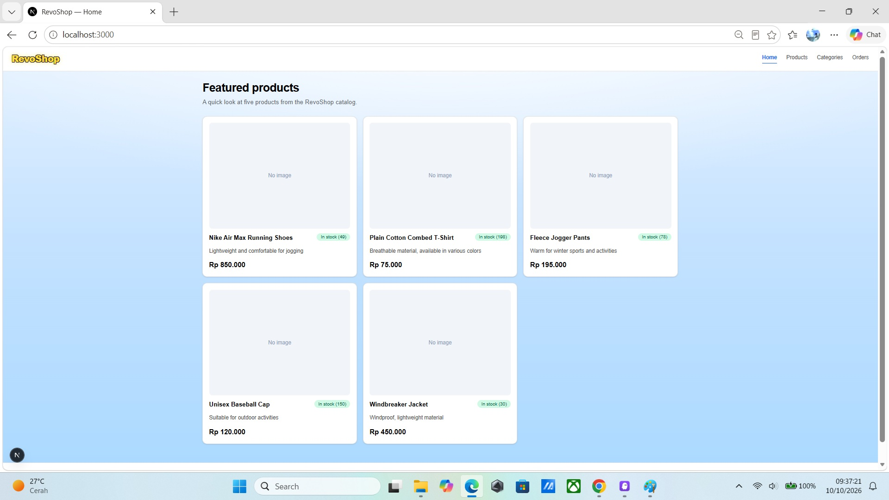

### Products — live search and category filtering

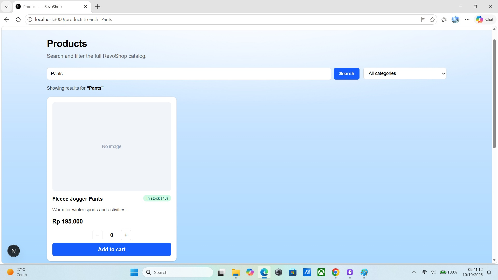

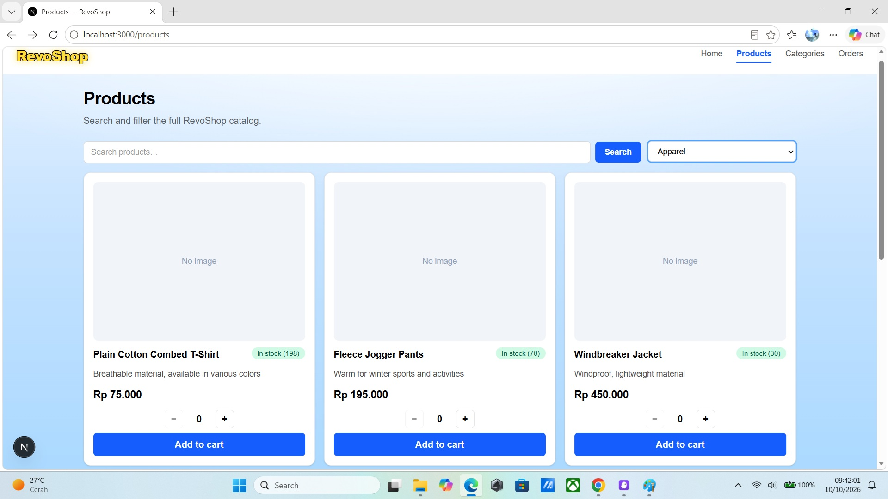

### Product detail — dynamic page title

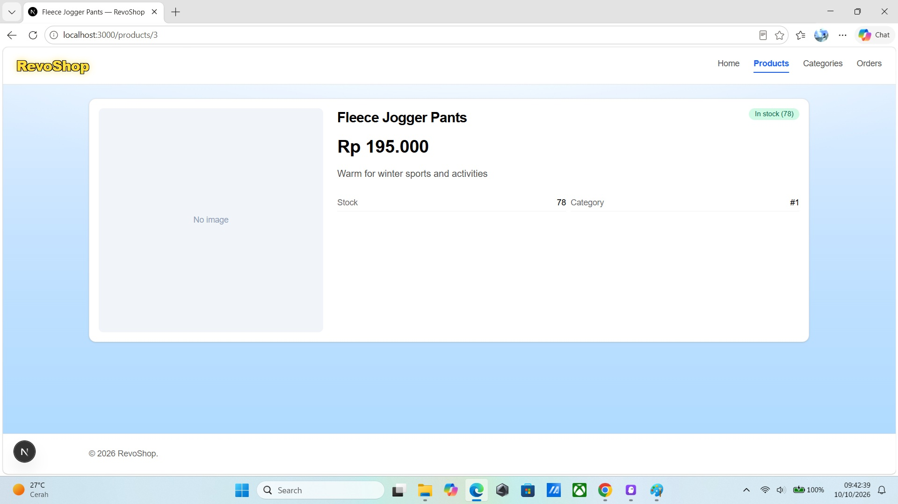

### Active-route highlighting

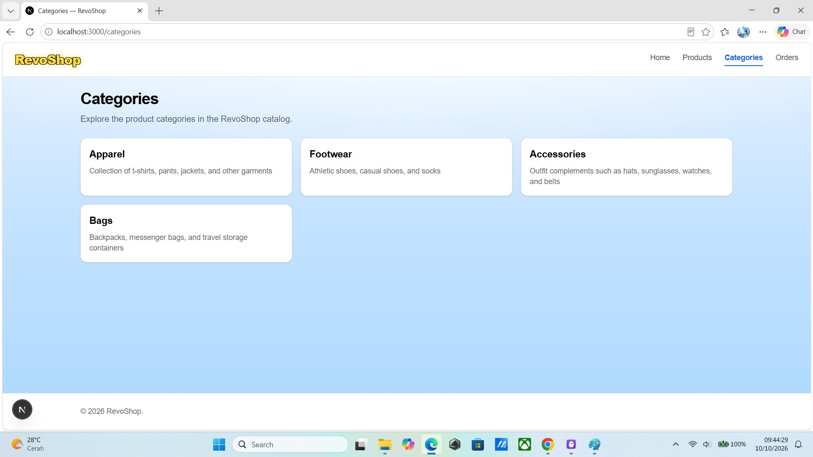

### Categories and orders

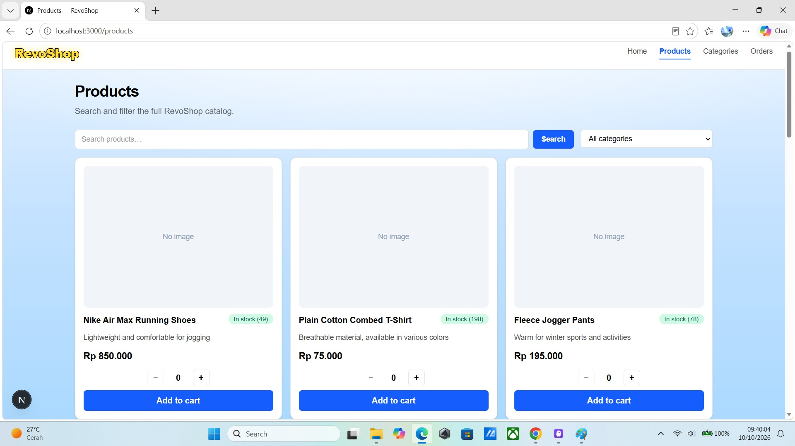

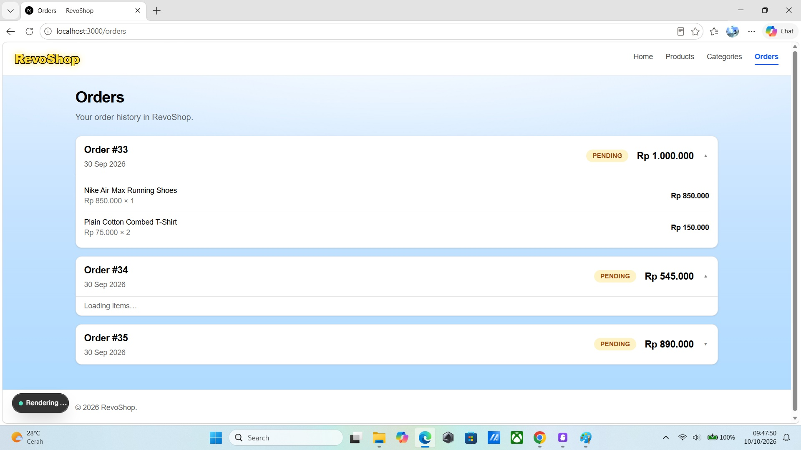

### Loading states (`loading.tsx`)

Every data-fetching route renders a skeleton while its Server Component fetch is in flight.

| Route | Screenshot |
|---|---|
| Home | 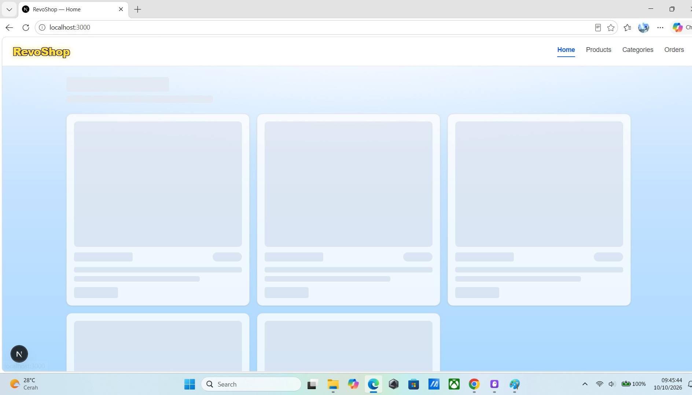 |
| Products | 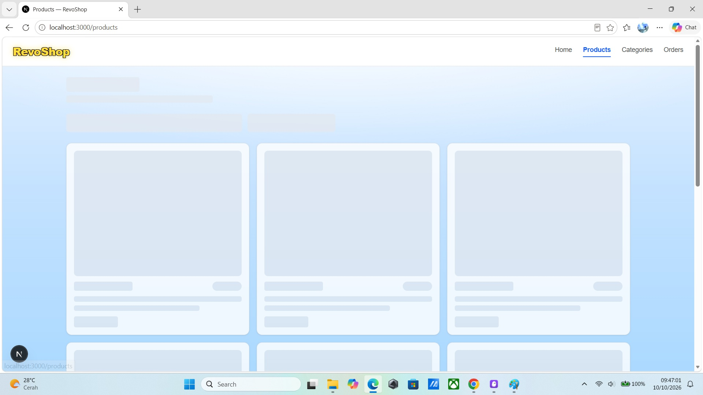 |
| Product detail | 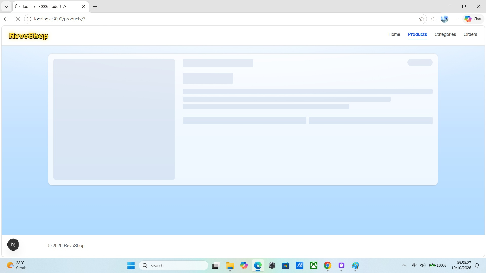 |
| Categories | 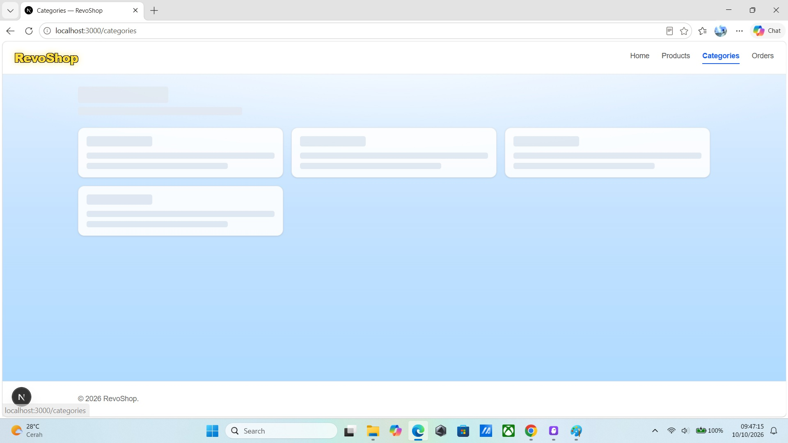 |
| Orders | 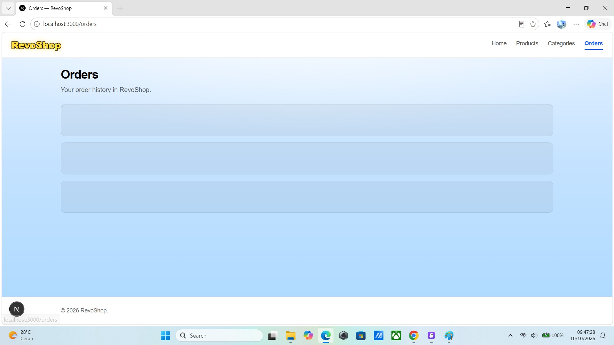 |

### Error states (`error.tsx`)

Captured by pointing `NEXT_PUBLIC_API_BASE_URL` at an unreachable host so every fetch throws. Each route catches the thrown error and shows a friendly recovery UI with a retry control.

| Route | Screenshot |
|---|---|
| Home | 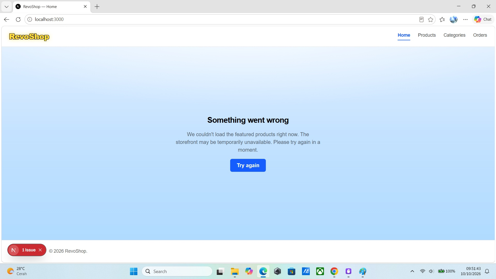 |
| Products |  |
| Product detail | 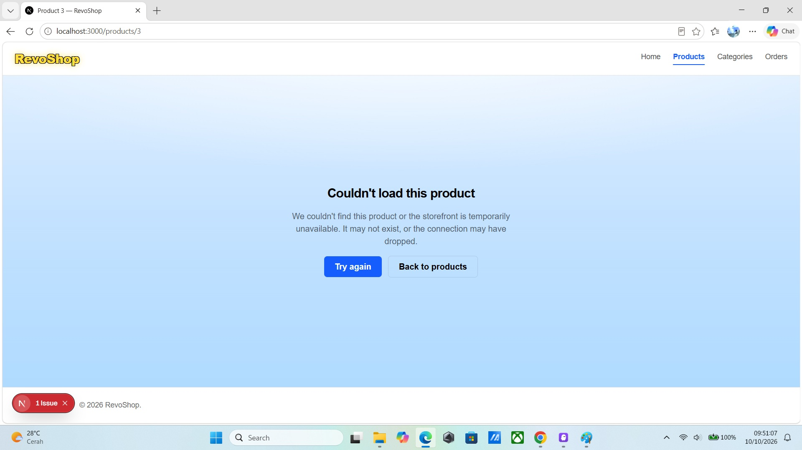 |
| Categories | 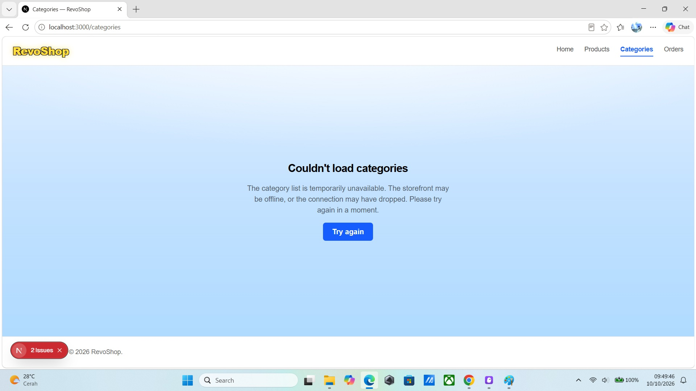 |
| Orders | 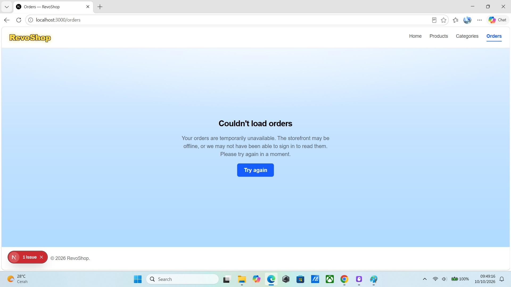 |
