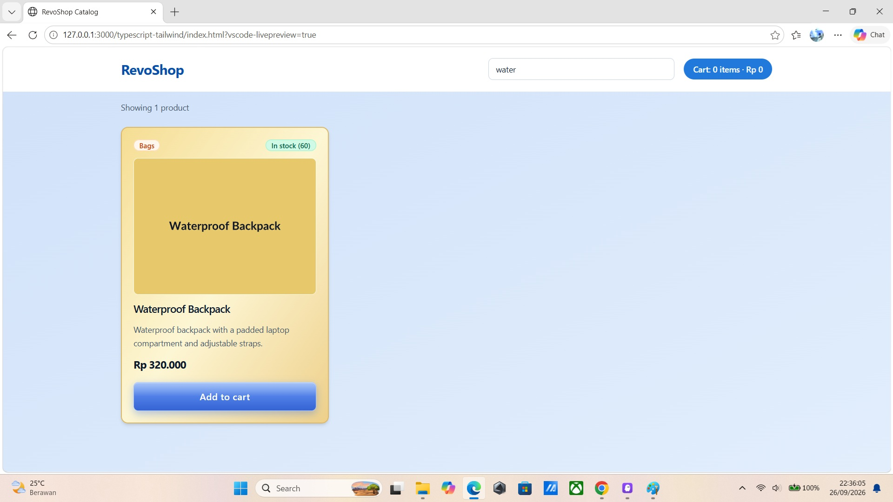
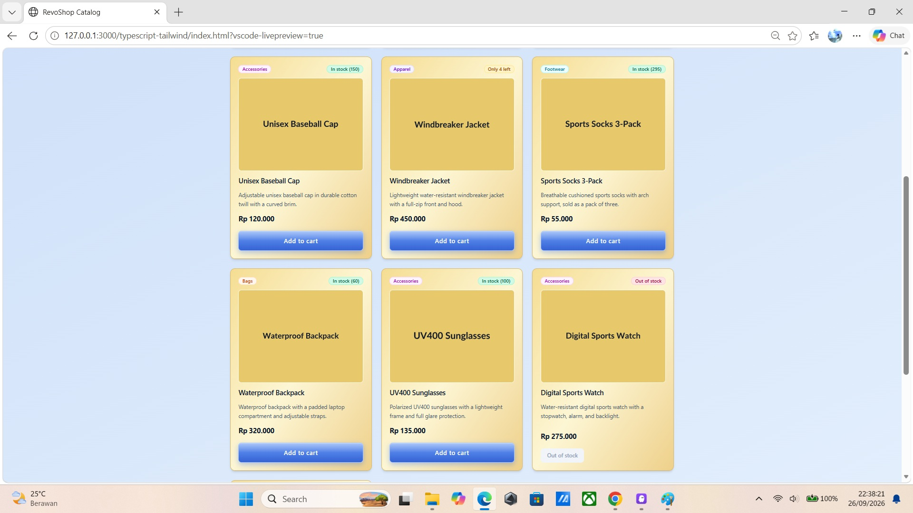

# Checkpoint 1 — RevoShop Frontend Foundations

Frontend fundamentals for RevoShop: semantic HTML/CSS, vanilla JavaScript, TypeScript, and Tailwind CSS. No framework, no bundler — the point of this checkpoint is the raw building blocks that React and Tailwind sit on top of, before the RevoShop application itself is built in Checkpoint 2.

## Repository layout

- **`html-css/`** — A semantic, responsive profile page with a contact form. Built from HTML5 landmark elements (`header`, `nav`, `main`, `section`, `footer`), laid out with CSS Grid and Flexbox, with a responsive breakpoint and a CSS-only light/dark mode toggle.
- **`javascript/`** — Two vanilla JavaScript exercises:
  - `dom-events.html` / `dom-events.js` — DOM manipulation and event handling (select/update elements, toggle classes, create/remove elements, `click` and `submit` handlers with `preventDefault`).
  - `array-methods.html` / `array-methods.js` — array processing with `forEach`, `map`, `filter`, and `reduce`.
- **`typescript-tailwind/`** — A `tsconfig.json`-configured TypeScript project with Tailwind CSS, implementing a fully typed, interactive product catalog: typed product data, Tailwind-styled cards, a live search filter, and an add-to-cart counter. This is the direct predecessor of the React ProductCard from Checkpoint 2.
- **`screenshots/`** — Screenshots referenced from this README.

## Running each exercise

### `html-css/` and `javascript/` — no build step

Open the HTML file directly in a browser (double-click it, or drag it into a browser window):

- `html-css/index.html`
- `javascript/dom-events.html`
- `javascript/array-methods.html`

These use classic `<script>` tags rather than ES modules, so they run straight from the `file://` protocol with no server and no install.

### `typescript-tailwind/` — build, then serve

This exercise compiles TypeScript to JavaScript and Tailwind classes to CSS, then loads the result as ES modules. Because browsers refuse to load ES modules over the `file://` protocol (CORS), opening `index.html` directly leaves the page unstyled and inert — it must be served over `http://`.

```bash
cd typescript-tailwind
npm install
npm run build      # compiles src/*.ts to dist/ and builds dist/output.css
npm run serve      # serves the folder at http://localhost:5173
```

Then open <http://localhost:5173> in a browser.

Useful scripts:

- `npm run build` — one-off build of both TypeScript and CSS
- `npm run watch:ts` / `npm run watch:css` — rebuild on change during development
- `npm run typecheck` — type-check without emitting (`tsc --noEmit`)

### Tailwind configuration note

This project uses **Tailwind CSS v4**, which has no `tailwind.config.js` and no `npx tailwindcss init` step. Configuration lives in `src/input.css` instead:

- `@import "tailwindcss";` installs Tailwind.
- `@source` declares the files to scan for class names.
- `@theme` defines custom design tokens (colors, fonts), which become real utility classes.

Styling throughout the project is utility-first — utility classes in the markup rather than bespoke CSS rules.

## Data note

The typed catalog uses the ten real RevoShop products, modelled to match the backend `products` and `categories` tables (snake_case fields, category referenced by id, availability derived from a stock count).

**Two `stock_quantity` values are deliberately altered from the live table** so that every availability state is visible and can be screenshotted:

- **Windbreaker Jacket** — lowered to `4` to show the **low-stock** badge.
- **Digital Sports Watch** — set to `0` to show the **out-of-stock** state and the disabled add-to-cart button.

The other eight products keep their real stock values. This is a demonstration convenience, not a schema mismatch.

## Screenshots

### Profile page — desktop


### Profile page — mobile


### Typed product catalog — live search



### Typed product catalog — availability states


